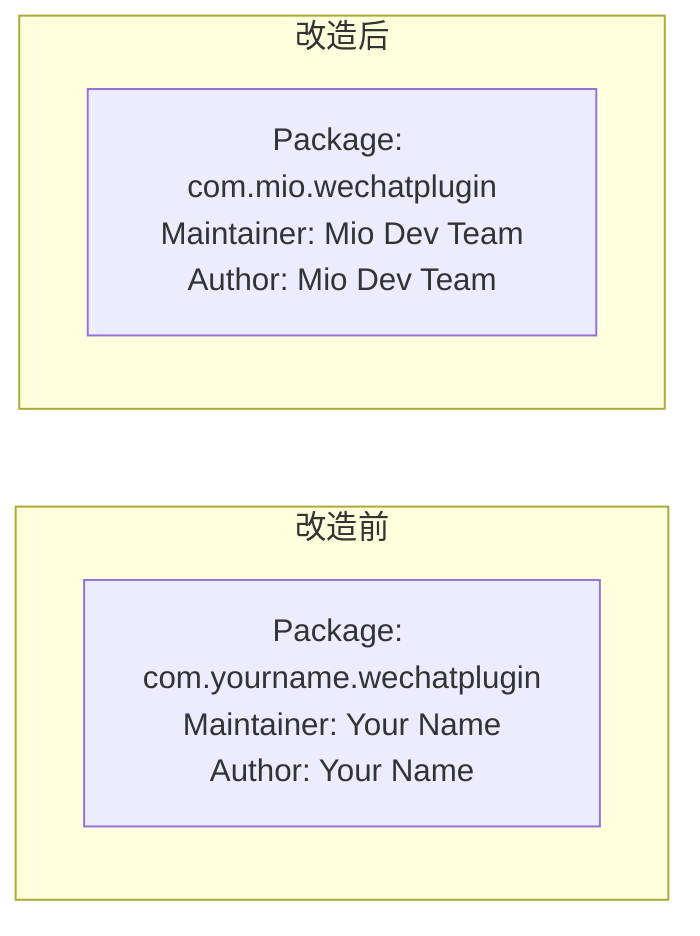
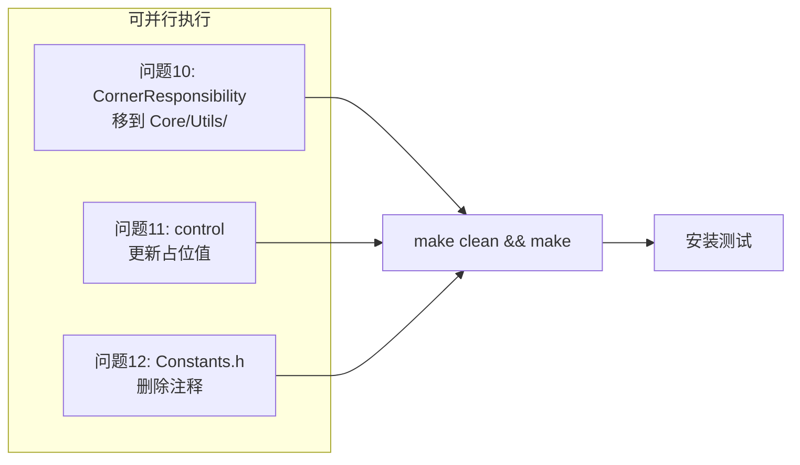

# 问题10/11/12 改造方案：低优先级遗留项清理

> **关联文档**: [MioPlugin_架构深度分析报告.md](file:///www/wwwroot/ios/MioPlugin_架构深度分析报告.md)  
> **改造目标**: 清理 3 个低优先级问题：CornerResponsibility 目录归属、control 占位信息、Constants.h 遗留注释  
> **方案类型**: 终极方案（均为一次性清理，无需未来维护）  
> **说明**: 本文档仅提供改造方案，不涉及实际代码修改。3 个问题不互相依赖，可独立执行。

---

## 总览

| 问题 | 优先级 | 改造类型 | 预计耗时 |
|------|:-----:|:--------:|:-------:|
| 问题 10：CornerResponsibility 归属 | 低 | 目录移动 + import 更新 | ~3 分钟 |
| 问题 11：control 文件占位信息 | 低 | 更新占位值 | ~1 分钟 |
| 问题 12：Constants.h 遗留注释 | 低 | 删除一行注释 | ~10 秒 |

三个问题**均不影响运行时功能**，属于代码整洁度优化。

---

## 一、问题 10：CornerResponsibility 目录归属

### 1.1 问题分析

**当前状态**:
```
Modules/
└── CornerResponsibility/
    ├── CornerResponsibility.h   ← 工具类：判断 VC 是否应应用圆角
    └── CornerResponsibility.m
```

**问题**: `CornerResponsibility` 放在 `Modules/` 目录下，暗示它是一个独立的功能模块。但实际上它只是一个**工具类**（Utility），提供静态方法 `+isListCornerResponsibleFor:`，仅被 `ListCornerRadiusHook.m` 作为助手调用。

**对比**:
- 真正的 **Modules** 有 Config（配置类）、Hook（安装 Hook）、Controller（设置页面）  
- **CornerResponsibility** 只有 1 个静态方法 + 1 个枚举定值

### 1.2 最佳方案

将 `CornerResponsibility` 从 `Modules/` 移动到 `Core/Utils/`，使其位置反映其职能——**工具类**，而不是模块。

| 维度 | 改造前 | 改造后 |
|------|:-----:|:-----:|
| 文件位置 | `Modules/CornerResponsibility/` | `Core/Utils/CornerResponsibility/` |
| 文件数量 | 2 个（.h + .m） | 2 个（不变） |
| 修改 import | 0 处 | **1 处**（ListCornerRadiusHook.m） |
| 编译影响 | — | 需重新 make |

### 1.3 具体步骤

```bash
# Step 1: 创建目标目录
mkdir -p Core/Utils/CornerResponsibility

# Step 2: 移动文件
mv Modules/CornerResponsibility/CornerResponsibility.h Core/Utils/CornerResponsibility/
mv Modules/CornerResponsibility/CornerResponsibility.m Core/Utils/CornerResponsibility/

# Step 3: 删除原目录
rmdir Modules/CornerResponsibility/
```

### 1.4 更新 import

```objc
// ── 改造前: ListCornerRadiusHook.m ──

#import "../CornerResponsibility/CornerResponsibility.h"


// ── 改造后: ListCornerRadiusHook.m ──

#import "../../Core/Utils/CornerResponsibility/CornerResponsibility.h"
```

### 1.5 改造后文件结构

```
Core/Utils/
├── CornerResponsibility/           ← ★ 移动至此
│   ├── CornerResponsibility.h
│   └── CornerResponsibility.m
└── (其他工具类，如 WPColorUtil、WPUtility 已在 Core/ 根目录)
```

> **注**: `WPColorUtil` 和 `WPUtility` 当前在 `Config/` 和 `Core/` 根目录。如果将来也统一工具类目录，可以把它们也移入 `Core/Utils/`，但这不是本方案的范围。

---

## 二、问题 11：control 文件占位信息

### 2.1 问题分析

**当前文件**: [MioPlugin/control](file:///www/wwwroot/ios/MioPlugin/control)

```
Package: com.yourname.wechatplugin   ← 占位符，未替换为实际包名
Name: Mio助手
Depends: mobilesubstrate
Version: 1.0.0                        ← 首次发布后应随版本更新
Architecture: iphoneos-arm64
Description: 微信增强插件 - 防撤回、红包提醒等功能
Maintainer: Your Name                 ← 占位符
Author: Your Name                     ← 占位符
Section: Tweaks
```

**问题**: `Package`、`Maintainer`、`Author` 为占位值。打包分发前应替换为真实信息。

### 2.2 最佳方案



**原则**: 选择符合个人或团队风格的标识符，一旦设定不建议频繁更改（会影响 Cydia/Sileo 的包管理系统）。

**推荐值**:

| 字段 | 占位值 | 推荐替换值 | 说明 |
|------|:-----:|:----------:|------|
| `Package` | `com.yourname.wechatplugin` | `com.yourhandle.mioplugin` | 使用你的唯一标识 |
| `Maintainer` | `Your Name` | 你的真实名字或昵称 | 用户联系维护者的方式 |
| `Author` | `Your Name` | 同上 | — |
| `Version` | `1.0.0` | 按实际版本（保持递增） | 每次发布递增 |

### 2.3 具体内容

```diff
- Package: com.yourname.wechatplugin
+ Package: com.yourhandle.mioplugin
  Name: Mio助手
  Depends: mobilesubstrate
- Version: 1.0.0
+ Version: 1.0.0   ← 按实际版本填写，保持递增
  Architecture: iphoneos-arm64
  Description: 微信增强插件 - 防撤回、红包提醒等功能
- Maintainer: Your Name
+ Maintainer: 你的名字 <your.email@example.com>
- Author: Your Name
+ Author: 你的名字
  Section: Tweaks
```

### 2.4 常见问题

| 问题 | 回答 |
|------|------|
| 包名可以用已经存在的吗？ | **不可以**。包名必须是唯一的。推荐使用自己的域名反向格式 |
| 更新 version 后需要做什么？ | 更新后重新 `make package` 打包 |
| Maintainer 和 Author 有什么区别？ | Maintainer 是当前包的维护者，Author 是原始作者。可为同一人 |

---

## 三、问题 12：Constants.h 遗留重构注释

### 3.1 问题分析

**当前文件**: [Config/Constants.h](file:///www/wwwroot/ios/MioPlugin/Config/Constants.h)

```objc
#ifndef Constants_h
#define Constants_h

#import <Foundation/Foundation.h>

static NSString *const kPluginVersion = @"1.0.0";
// kPluginPrefix 已移至 ConfigManager.h 统一管理    ← 问题 12：遗留重构注释
static const unsigned int kSystemMsgType = 0x2710;
...
#endif
```

**问题**: 第 7 行的注释 `// kPluginPrefix 已移至 ConfigManager.h 统一管理` 是一次重构事件的记录。这个信息：
- **对当前开发者无用**（已经移走了，知道这个事实对理解代码没有任何帮助）
- **不是 API 文档**（如果是 API 说明，应该写在 ConfigManager.h 中）
- **不会有人去更新或删除它**（如果将来又把 kPluginPrefix 移回来，这个注释只会误导人）

### 3.2 最佳方案

```diff
 static NSString *const kPluginVersion = @"1.0.0";
-// kPluginPrefix 已移至 ConfigManager.h 统一管理
 static const unsigned int kSystemMsgType = 0x2710;
```

**仅删除**这一行注释。不影响任何代码逻辑。

### 3.3 为什么不做更复杂的事情

| 被否决的方案 | 原因 |
|-------------|------|
| 把 kPluginPrefix 的定义也加到 Constants.h | 重复定义，违反 DRY |
| 加更详细的注释说明"为什么移走" | 信息熵太低，3 个月后没人关心 |
| 把 Constants.h 整个重构到 Config 目录 | 过度设计，Constants.h 的职责就是放常量 |

---

## 四、执行顺序与依赖



三个问题**完全独立**，可任意顺序执行或只执行其中一部分。

---

## 五、用户角度测试

### 5.1 测试说明

这三个改动均**不影响运行时行为**，只有文件结构变化和文本变化。测试目的是确认没有引入编译错误。

### 5.2 编译测试（核心测试）

```bash
cd /www/wwwroot/ios/MioPlugin
make clean && make
```

预期结果：
- **无 error**
- **无 warning**

常见的错误及修复：

```
error: 'CornerResponsibility/CornerResponsibility.h' file not found
→ ListCornerRadiusHook.m 中的 import 路径需要更新为 "../../Core/Utils/CornerResponsibility/CornerResponsibility.h"
```

### 5.3 功能回归测试（可选）

由于 3 个改动都不涉及运行时逻辑，功能测试可以快速跳过。但为保险起见：

| 测试 | 操作 | 预期 |
|------|------|------|
| **列表圆角** | 开启列表圆角 → 查看微信列表 | 圆角正常（CornerResponsibility 调用正常） |
| **打包** | `make package` | 生成 .deb 包（control 文件格式正确） |
| **设置页** | 进入 Mio助手设置页 | 正常加载（Constants.h 常量可用） |

### 5.4 最终文件确认

```bash
# 确认 CornerResponsibility 已移动
ls -la Core/Utils/CornerResponsibility/
# 应显示 CornerResponsibility.h 和 .m

# 确认旧目录已删除
ls -la Modules/CornerResponsibility/
# 应显示 "No such file or directory"

# 确认 control 文件已更新
head -1 control
# 应显示新包名，不是 com.yourname

# 确认 Constants.h 无遗留注释
grep -n "已移至" Config/Constants.h
# 应无输出
```

---

## 六、改造总结

| 问题 | 操作 | 改前 | 改后 |
|:----:|------|:----:|:----:|
| 10 | 移动 CornerResponsibility 目录 | `Modules/` 下 | `Core/Utils/` 下 |
| 10 | 更新 ListCornerRadiusHook.m import | 旧路径 | 新路径 |
| 11 | 更新 control 占位值 | `Your Name` 等 | 实际信息 |
| 12 | 删除 Constants.h 遗留注释 | 1 行注释 | 0 行 |
| — | 编译验证 | — | `make clean && make` 零 error |

**一句话总结**: 三个改动合计约 **5 分钟** 工作量，均为一次性清理，不影响任何运行时行为。

---

*文档结束*