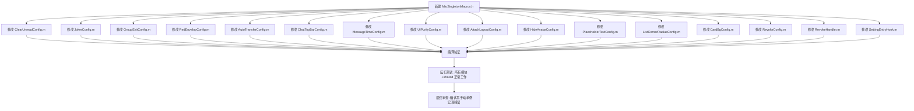

# 问题1 改造方案：Config 单例实现方式不统一

> **关联文档**: [MioPlugin_架构深度分析报告.md](file:///www/wwwroot/ios/MioPlugin_架构深度分析报告.md) — 问题1  
> **改造目标**: 消除项目中两种单例实现风格的差异，建立**唯一、标准、零模板代码**的单例模式  
> **方案类型**: 终极统一方案（非补丁）  
> **说明**: 本文档仅提供改造方案，不涉及实际代码修改。

---

## 一、现状分析

### 1.1 两种风格分布

目前项目中存在 **2 种单例实现风格**，分布在 **15 个文件**（14 个 Config 模块 + 1 个非 Config 工具类）：

#### 风格 A（Apple 推荐模式）—— 2 个文件

变量作用域限定在方法内部，无文件级静态变量泄露。

**RevokeConfig.m**:
```objc
@implementation RevokeConfig

#pragma mark - Singleton

+ (instancetype)shared {
    static RevokeConfig *instance = nil;       // ← 方法内局部静态变量
    static dispatch_once_t onceToken;
    dispatch_once(&onceToken, ^{
        instance = [[RevokeConfig alloc] init];
    });
    return instance;
}

- (instancetype)init {
    self = [super init];
    if (self) {
        _sessionFormats = [NSMutableDictionary dictionary];
        _userFormats = [NSMutableDictionary dictionary];
    }
    return self;
}
// ... 其余方法
@end
```

**RevokeHandler.m**:
```objc
+ (instancetype)shared {
    static RevokeHandler *instance = nil;
    static dispatch_once_t onceToken;
    dispatch_once(&onceToken, ^{ instance = [[RevokeHandler alloc] init]; });
    return instance;
}
```

#### 风格 B（文件级静态变量）—— 13 个文件

存在一个文件作用域的 `static _sharedInstance` 变量，造成不必要的符号暴露。

| # | 文件 | 具体代码 |
|---|------|---------|
| 1 | [ClearUnreadConfig.m](file:///www/wwwroot/ios/MioPlugin/Modules/Unread/ClearUnreadConfig.m) | `static ClearUnreadConfig *_sharedInstance = nil;` |
| 2 | [JokerConfig.m](file:///www/wwwroot/ios/MioPlugin/Modules/Joker/JokerConfig.m) | `static JokerConfig *_sharedInstance = nil;` |
| 3 | [GroupExitConfig.m](file:///www/wwwroot/ios/MioPlugin/Modules/GroupExit/GroupExitConfig.m) | `static GroupExitConfig *_sharedInstance = nil;` |
| 4 | [RedEnvelopConfig.m](file:///www/wwwroot/ios/MioPlugin/Modules/RedEnvelop/RedEnvelopConfig.m) | `static RedEnvelopConfig *_sharedInstance = nil;` |
| 5 | [AutoTransferConfig.m](file:///www/wwwroot/ios/MioPlugin/Modules/AutoTransfer/AutoTransferConfig.m) | `static AutoTransferConfig *_sharedInstance = nil;` |
| 6 | [ChatTopBarConfig.m](file:///www/wwwroot/ios/MioPlugin/Modules/ChatTopBar/ChatTopBarConfig.m) | `static ChatTopBarConfig *_sharedInstance = nil;` |
| 7 | [MessageTimeConfig.m](file:///www/wwwroot/ios/MioPlugin/Modules/MessageTime/MessageTimeConfig.m) | `static MessageTimeConfig *_sharedInstance = nil;` |
| 8 | [UIPurifyConfig.m](file:///www/wwwroot/ios/MioPlugin/Modules/Layout/UIPurifyConfig.m) | `static UIPurifyConfig *_sharedInstance = nil;` |
| 9 | [AttachLayoutConfig.m](file:///www/wwwroot/ios/MioPlugin/Modules/Layout/AttachLayoutConfig.m) | `static AttachLayoutConfig *_sharedInstance = nil;` |
| 10 | [HideAvatarConfig.m](file:///www/wwwroot/ios/MioPlugin/Modules/HideAvatar/HideAvatarConfig.m) | `static HideAvatarConfig *_sharedInstance = nil;` |
| 11 | [PlaceholderTextConfig.m](file:///www/wwwroot/ios/MioPlugin/Modules/PlaceholderText/PlaceholderTextConfig.m) | `static PlaceholderTextConfig *_sharedInstance = nil;` |
| 12 | [ListCornerRadiusConfig.m](file:///www/wwwroot/ios/MioPlugin/Modules/ListCornerRadius/ListCornerRadiusConfig.m) | `static ListCornerRadiusConfig *_sharedInstance = nil;` |
| 13 | [CardBgConfig.m](file:///www/wwwroot/ios/MioPlugin/Modules/ProfileCardBg/CardBgConfig.m) | `static CardBgConfig *_sharedInstance = nil;` |

风格 B 的典型代码（以 ClearUnreadConfig.m 为例）:
```objc
@implementation ClearUnreadConfig

static ClearUnreadConfig *_sharedInstance = nil;   // ← 文件级静态变量（多余）

+ (instancetype)shared {
    static dispatch_once_t onceToken;
    dispatch_once(&onceToken, ^{
        _sharedInstance = [[ClearUnreadConfig alloc] init];
    });
    return _sharedInstance;
}

// ... 其余方法
@end
```

### 1.2 此外还存在另一种命名风格

`MioPluginSwitchHandler` 使用 `sharedInstance` 而非 `shared` 作为方法名:

```objc
// SettingEntryHook.m 第135行
+ (instancetype)sharedInstance {
    static MioPluginSwitchHandler *instance = nil;
    static dispatch_once_t onceToken;
    dispatch_once(&onceToken, ^{
        instance = [[MioPluginSwitchHandler alloc] init];
    });
    return instance;
}
```

这已经是风格 A 的实现，但方法名不同。

### 1.3 当前问题的本质

| 维度 | 风格 A | 风格 B |
|------|--------|--------|
| 文件级静态变量 | 无 | 有（_sharedInstance） |
| 变量作用域 | 方法内 | 整个文件 |
| 符号污染 | 无 | 有（其他方法可意外访问） |
| Apple 推荐度 | 官方推荐 | 历史遗留 |
| 一致性 | RevokeConfig + RevokeHandler | 其余 13 个模块 |

---

## 二、改造方案：宏定义统一

### 2.1 方案选择理由

| 方案 | 优点 | 缺点 |
|------|------|------|
| **A. 逐文件手动统一为风格 A** | 简单直接 | 每新增一个模块仍然需要写 7 行模板代码；一旦要改（如加断言、加日志），要改 15 个文件 |
| **B. 宏定义统一（推荐）** | 零模板代码；单点修改；强迫新增模块一致 | 需要理解宏 |
| **C. 宏 + 协议默认实现** | 最自动化 | ObjC 协议不能定义类方法默认实现（无类协议扩展） |

**选择方案 B**，因为：
- 消除 15 个文件中重复的 7 行模板 → 每文件仅 1 行
- 未来新增模块自动一致，无需记忆"该用哪种风格"
- 如果后续需要修改单例模式（如加断言、加初始化日志），**改一个地方即可**

### 2.2 创建宏头文件

在 `Core/` 目录下新建文件 `MioSingletonMacros.h`：

```objc
//
//  MioSingletonMacros.h
//  MioPlugin
//
//  统一单例宏定义。
//  所有需要实现 +shared 单例的类，在 @implementation 中使用此宏，
//  可消除重复模板代码，确保所有模块的单例实现完全一致。
//
//  用法：
//    @implementation SomeClass
//    MIO_SINGLETON_IMPL(SomeClass)
//    // ... 其他方法
//    @end
//

#import <Foundation/Foundation.h>

/// 标准单例宏：生成 + (instancetype)shared
/// 使用 Apple 推荐的作用域内静态变量模式，无文件级符号泄露。
/// @param classname 当前类的类名（如 MyConfig）
#define MIO_SINGLETON_IMPL(classname)                                             \
+ (instancetype)shared {                                                          \
    static classname *sharedInstance = nil;                                       \
    static dispatch_once_t onceToken;                                             \
    dispatch_once(&onceToken, ^{                                                  \
        sharedInstance = [[classname alloc] init];                                \
    });                                                                           \
    return sharedInstance;                                                        \
}

/// 替代命名单例宏：生成 + (instancetype)sharedInstance
/// 适用于方法名约定为 sharedInstance 而非 shared 的类。
/// @param classname 当前类的类名
#define MIO_SINGLETON_INSTANCE_IMPL(classname)                                    \
+ (instancetype)sharedInstance {                                                  \
    static classname *sharedInstance = nil;                                       \
    static dispatch_once_t onceToken;                                             \
    dispatch_once(&onceToken, ^{                                                  \
        sharedInstance = [[classname alloc] init];                                \
    });                                                                           \
    return sharedInstance;                                                        \
}
```

### 2.3 宏展开验证

展开后等价于：

```objc
// MIO_SINGLETON_IMPL(RevokeConfig)
+ (instancetype)shared {
    static RevokeConfig *sharedInstance = nil;
    static dispatch_once_t onceToken;
    dispatch_once(&onceToken, ^{
        sharedInstance = [[RevokeConfig alloc] init];
    });
    return sharedInstance;
}
```

与风格 A 的关键差异：
- 内部变量名统一为 `sharedInstance`（而非 `instance`），更具可读性
- **没有文件级 `_sharedInstance`** → 不会意外被文件内其他代码访问

---

## 三、逐文件改造对照

所有改造遵循同一模式：
1. **删除** `static XXX *_sharedInstance = nil;`（如果有）
2. **删除** `+shared` 方法的旧实现
3. **替换为** `MIO_SINGLETON_IMPL(XXX)`

### 3.1 文件级 static 变量类（13 个文件）—— 改造对照表

#### 文件 1: ClearUnreadConfig.m

```objc
// ── 改造前 ─────────────────────────────────────────────
@implementation ClearUnreadConfig

static ClearUnreadConfig *_sharedInstance = nil;

+ (instancetype)shared {
    static dispatch_once_t onceToken;
    dispatch_once(&onceToken, ^{
        _sharedInstance = [[ClearUnreadConfig alloc] init];
    });
    return _sharedInstance;
}

+ (NSString *)modulePrefix {
// ── 改造后 ─────────────────────────────────────────────
#import "../../Core/MioSingletonMacros.h"     // ★ 添加导入

@implementation ClearUnreadConfig

MIO_SINGLETON_IMPL(ClearUnreadConfig)          // ★ 一行代替 9 行

+ (NSString *)modulePrefix {
```

#### 文件 2: JokerConfig.m

```objc
// ── 改造前 ─────────────────────────────────────────────
@implementation JokerConfig

static JokerConfig *_sharedInstance = nil;

+ (instancetype)shared {
    static dispatch_once_t onceToken;
    dispatch_once(&onceToken, ^{
        _sharedInstance = [[JokerConfig alloc] init];
    });
    return _sharedInstance;
}

+ (NSString *)modulePrefix {
// ── 改造后 ─────────────────────────────────────────────
#import "../../Core/MioSingletonMacros.h"

@implementation JokerConfig

MIO_SINGLETON_IMPL(JokerConfig)

+ (NSString *)modulePrefix {
```

#### 文件 3: GroupExitConfig.m

```objc
// ── 改造前 ─────────────────────────────────────────────
#import "GroupExitConfig.h"
#import "GroupExitHook.h"

@implementation GroupExitConfig

static GroupExitConfig *_sharedInstance = nil;

+ (instancetype)shared {
    static dispatch_once_t onceToken;
    dispatch_once(&onceToken, ^{
        _sharedInstance = [[GroupExitConfig alloc] init];
    });
    return _sharedInstance;
}

+ (NSString *)modulePrefix {
// ── 改造后 ─────────────────────────────────────────────
#import "GroupExitConfig.h"
#import "GroupExitHook.h"
#import "../../Core/MioSingletonMacros.h"

@implementation GroupExitConfig

MIO_SINGLETON_IMPL(GroupExitConfig)

+ (NSString *)modulePrefix {
```

#### 文件 4: RedEnvelopConfig.m

```objc
// ── 改造前 ─────────────────────────────────────────────
@implementation RedEnvelopConfig

static RedEnvelopConfig *_sharedInstance = nil;

+ (instancetype)shared {
    static dispatch_once_t onceToken;
    dispatch_once(&onceToken, ^{
        _sharedInstance = [[RedEnvelopConfig alloc] init];
    });
    return _sharedInstance;
}

+ (NSString *)modulePrefix {
// ── 改造后 ─────────────────────────────────────────────
#import "../../Core/MioSingletonMacros.h"

@implementation RedEnvelopConfig

MIO_SINGLETON_IMPL(RedEnvelopConfig)

+ (NSString *)modulePrefix {
```

#### 文件 5: AutoTransferConfig.m

```objc
// ── 改造前 ─────────────────────────────────────────────
@implementation AutoTransferConfig

static AutoTransferConfig *_sharedInstance = nil;

+ (instancetype)shared {
    static dispatch_once_t onceToken;
    dispatch_once(&onceToken, ^{
        _sharedInstance = [[AutoTransferConfig alloc] init];
    });
    return _sharedInstance;
}

+ (NSString *)modulePrefix {
// ── 改造后 ─────────────────────────────────────────────
#import "../../Core/MioSingletonMacros.h"

@implementation AutoTransferConfig

MIO_SINGLETON_IMPL(AutoTransferConfig)

+ (NSString *)modulePrefix {
```

#### 文件 6: ChatTopBarConfig.m

```objc
// ── 改造前 ─────────────────────────────────────────────
#import "ChatTopBarConfig.h"

@implementation ChatTopBarConfig

// MARK: - 单例
static ChatTopBarConfig *_sharedInstance = nil;

+ (instancetype)shared {
    static dispatch_once_t onceToken;
    dispatch_once(&onceToken, ^{
        _sharedInstance = [[ChatTopBarConfig alloc] init];
    });
    return _sharedInstance;
}

// MARK: - ConfigModule 协议
+ (NSArray<ConfigDescriptor *> *)descriptors {
// ── 改造后 ─────────────────────────────────────────────
#import "ChatTopBarConfig.h"
#import "../../Core/MioSingletonMacros.h"

@implementation ChatTopBarConfig

MIO_SINGLETON_IMPL(ChatTopBarConfig)           // ★ 一行代替 10 行（含注释）

// MARK: - ConfigModule 协议
+ (NSArray<ConfigDescriptor *> *)descriptors {
```

#### 文件 7: MessageTimeConfig.m

```objc
// ── 改造前 ─────────────────────────────────────────────
#import "MessageTimeConfig.h"

static MessageTimeConfig *_sharedInstance = nil;

@implementation MessageTimeConfig

+ (instancetype)shared {
    static dispatch_once_t onceToken;
    dispatch_once(&onceToken, ^{
        _sharedInstance = [[MessageTimeConfig alloc] init];
    });
    return _sharedInstance;
}

+ (NSString *)modulePrefix {
// ── 改造后 ─────────────────────────────────────────────
#import "MessageTimeConfig.h"
#import "../../Core/MioSingletonMacros.h"

@implementation MessageTimeConfig

MIO_SINGLETON_IMPL(MessageTimeConfig)

+ (NSString *)modulePrefix {
```

#### 文件 8: UIPurifyConfig.m

```objc
// ── 改造前 ─────────────────────────────────────────────
@implementation UIPurifyConfig

static UIPurifyConfig *_sharedInstance = nil;

+ (instancetype)shared {
    static dispatch_once_t onceToken;
    dispatch_once(&onceToken, ^{
        _sharedInstance = [[UIPurifyConfig alloc] init];
    });
    return _sharedInstance;
}

+ (NSString *)modulePrefix {
// ── 改造后 ─────────────────────────────────────────────
#import "../../Core/MioSingletonMacros.h"

@implementation UIPurifyConfig

MIO_SINGLETON_IMPL(UIPurifyConfig)

+ (NSString *)modulePrefix {
```

#### 文件 9: AttachLayoutConfig.m

```objc
// ── 改造前 ─────────────────────────────────────────────
@implementation AttachLayoutConfig

static AttachLayoutConfig *_sharedInstance = nil;

+ (instancetype)shared {
    static dispatch_once_t onceToken;
    dispatch_once(&onceToken, ^{
        _sharedInstance = [[AttachLayoutConfig alloc] init];
    });
    return _sharedInstance;
}

+ (NSString *)modulePrefix {
// ── 改造后 ─────────────────────────────────────────────
#import "../../Core/MioSingletonMacros.h"

@implementation AttachLayoutConfig

MIO_SINGLETON_IMPL(AttachLayoutConfig)

+ (NSString *)modulePrefix {
```

#### 文件 10: HideAvatarConfig.m

```objc
// ── 改造前 ─────────────────────────────────────────────
@implementation HideAvatarConfig

static HideAvatarConfig *_sharedInstance = nil;

+ (instancetype)shared {
    static dispatch_once_t onceToken;
    dispatch_once(&onceToken, ^{
        _sharedInstance = [[HideAvatarConfig alloc] init];
    });
    return _sharedInstance;
}

+ (NSString *)modulePrefix {
// ── 改造后 ─────────────────────────────────────────────
#import "../../Core/MioSingletonMacros.h"

@implementation HideAvatarConfig

MIO_SINGLETON_IMPL(HideAvatarConfig)

+ (NSString *)modulePrefix {
```

#### 文件 11: PlaceholderTextConfig.m

```objc
// ── 改造前 ─────────────────────────────────────────────
@implementation PlaceholderTextConfig

static PlaceholderTextConfig *_sharedInstance = nil;

+ (instancetype)shared {
    static dispatch_once_t onceToken;
    dispatch_once(&onceToken, ^{
        _sharedInstance = [[PlaceholderTextConfig alloc] init];
    });
    return _sharedInstance;
}

+ (NSString *)modulePrefix {
// ── 改造后 ─────────────────────────────────────────────
#import "../../Core/MioSingletonMacros.h"

@implementation PlaceholderTextConfig

MIO_SINGLETON_IMPL(PlaceholderTextConfig)

+ (NSString *)modulePrefix {
```

#### 文件 12: ListCornerRadiusConfig.m

```objc
// ── 改造前 ─────────────────────────────────────────────
@implementation ListCornerRadiusConfig

static ListCornerRadiusConfig *_sharedInstance = nil;

+ (instancetype)shared {
    static dispatch_once_t onceToken;
    dispatch_once(&onceToken, ^{
        _sharedInstance = [[ListCornerRadiusConfig alloc] init];
    });
    return _sharedInstance;
}

+ (NSString *)modulePrefix {
// ── 改造后 ─────────────────────────────────────────────
#import "../../Core/MioSingletonMacros.h"

@implementation ListCornerRadiusConfig

MIO_SINGLETON_IMPL(ListCornerRadiusConfig)

+ (NSString *)modulePrefix {
```

#### 文件 13: CardBgConfig.m

```objc
// ── 改造前 ─────────────────────────────────────────────
@implementation CardBgConfig

static CardBgConfig *_sharedInstance = nil;

+ (instancetype)shared {
    static dispatch_once_t onceToken;
    dispatch_once(&onceToken, ^{
        _sharedInstance = [[CardBgConfig alloc] init];
    });
    return _sharedInstance;
}

+ (NSString *)modulePrefix {
// ── 改造后 ─────────────────────────────────────────────
#import "../../Core/MioSingletonMacros.h"

@implementation CardBgConfig

MIO_SINGLETON_IMPL(CardBgConfig)

+ (NSString *)modulePrefix {
```

### 3.2 无文件级 static 变量但可统一使用宏的类（2 个文件）

这两个文件已经是风格 A，但为了**完全统一**，也应使用宏：

#### 文件 14: RevokeConfig.m

```objc
// ── 改造前 ─────────────────────────────────────────────
#import "RevokeConfig.h"
#import "../../Core/ConfigManager.h"

@implementation RevokeConfig

#pragma mark - Singleton

+ (instancetype)shared {
    static RevokeConfig *instance = nil;
    static dispatch_once_t onceToken;
    dispatch_once(&onceToken, ^{
        instance = [[RevokeConfig alloc] init];
    });
    return instance;
}

- (instancetype)init {
    self = [super init];
    if (self) {
        _sessionFormats = [NSMutableDictionary dictionary];
        _userFormats = [NSMutableDictionary dictionary];
    }
    return self;
}

#pragma mark - ConfigModule Protocol

// ── 改造后 ─────────────────────────────────────────────
#import "RevokeConfig.h"
#import "../../Core/ConfigManager.h"
#import "../../Core/MioSingletonMacros.h"          // ★ 新增导入

@implementation RevokeConfig

MIO_SINGLETON_IMPL(RevokeConfig)                   // ★ 一行代替 9 行

- (instancetype)init {
    self = [super init];
    if (self) {
        _sessionFormats = [NSMutableDictionary dictionary];
        _userFormats = [NSMutableDictionary dictionary];
    }
    return self;
}

#pragma mark - ConfigModule Protocol
```

#### 文件 15: RevokeHandler.m

```objc
// ── 改造前 ─────────────────────────────────────────────
#import "RevokeHandler.h"
// ... 其他导入

@implementation RevokeHandler

+ (instancetype)shared {
    static RevokeHandler *instance = nil;
    static dispatch_once_t onceToken;
    dispatch_once(&onceToken, ^{ instance = [[RevokeHandler alloc] init]; });
    return instance;
}

// ── 改造后 ─────────────────────────────────────────────
#import "RevokeHandler.h"
#import "../../Core/MioSingletonMacros.h"          // ★ 新增导入
// ... 其他导入

@implementation RevokeHandler

MIO_SINGLETON_IMPL(RevokeHandler)                  // ★ 一行代替 6 行
```

### 3.3 命名不同的单例（1 个文件）

#### 文件 16: MioPluginSwitchHandler（位于 SettingEntryHook.m）

```objc
// ── 改造前 ─────────────────────────────────────────────
@implementation MioPluginSwitchHandler

+ (instancetype)sharedInstance {
    static MioPluginSwitchHandler *instance = nil;
    static dispatch_once_t onceToken;
    dispatch_once(&onceToken, ^{
        instance = [[MioPluginSwitchHandler alloc] init];
    });
    return instance;
}

// ── 改造后 ─────────────────────────────────────────────
// ★ 在 SettingEntryHook.m 顶部添加导入:
#import "../../Core/MioSingletonMacros.h"

@implementation MioPluginSwitchHandler

MIO_SINGLETON_INSTANCE_IMPL(MioPluginSwitchHandler)  // ★ 使用 INSTANCE 变体
```

---

## 四、改造汇总

### 4.1 改动统计

| 类别 | 文件数 | 操作 |
|------|--------|------|
| 新建文件 | 1 | `Core/MioSingletonMacros.h` |
| 修改文件 | 16 | 见下表 |
| 删除行数 | ~120 | 所有旧单例模板代码 |
| 新增行数 | ~17 | 16 个 `MIO_SINGLETON_IMPL()` + 1 个 `MIO_SINGLETON_INSTANCE_IMPL()` |
| 净减行数 | ~103 | |

### 4.2 完整修改清单

| # | 文件路径 | 操作 | 删除 | 新增 |
|---|---------|------|------|------|
| — | `Core/MioSingletonMacros.h` | **新建** | — | 40 行（宏定义 + 注释） |
| 1 | `Modules/Unread/ClearUnreadConfig.m` | 改 | 9 行 | 1 行 + 1 import |
| 2 | `Modules/Joker/JokerConfig.m` | 改 | 9 行 | 1 行 + 1 import |
| 3 | `Modules/GroupExit/GroupExitConfig.m` | 改 | 9 行 | 1 行 + 1 import |
| 4 | `Modules/RedEnvelop/RedEnvelopConfig.m` | 改 | 9 行 | 1 行 + 1 import |
| 5 | `Modules/AutoTransfer/AutoTransferConfig.m` | 改 | 9 行 | 1 行 + 1 import |
| 6 | `Modules/ChatTopBar/ChatTopBarConfig.m` | 改 | 11 行 | 1 行 + 1 import |
| 7 | `Modules/MessageTime/MessageTimeConfig.m` | 改 | 9 行 | 1 行 + 1 import |
| 8 | `Modules/Layout/UIPurifyConfig.m` | 改 | 9 行 | 1 行 + 1 import |
| 9 | `Modules/Layout/AttachLayoutConfig.m` | 改 | 9 行 | 1 行 + 1 import |
| 10 | `Modules/HideAvatar/HideAvatarConfig.m` | 改 | 9 行 | 1 行 + 1 import |
| 11 | `Modules/PlaceholderText/PlaceholderTextConfig.m` | 改 | 9 行 | 1 行 + 1 import |
| 12 | `Modules/ListCornerRadius/ListCornerRadiusConfig.m` | 改 | 9 行 | 1 行 + 1 import |
| 13 | `Modules/ProfileCardBg/CardBgConfig.m` | 改 | 9 行 | 1 行 + 1 import |
| 14 | `Modules/Revoke/RevokeConfig.m` | 改 | 9 行 | 1 行 + 1 import |
| 15 | `Modules/Revoke/RevokeHandler.m` | 改 | 6 行 | 1 行 + 1 import |
| 16 | `Modules/SettingEntry/SettingEntryHook.m` | 改 | 8 行 | 1 行 + 1 import |

### 4.3 import 路径对照

不同的模块目录层级不同，import 宏头的相对路径如下：

```
模块目录层级          import 路径                           文件举例
──────────────────────────────────────────────────────────────────────
Modules/*/           #import "../../Core/MioSingletonMacros.h"    ClearUnreadConfig.m
                     （从 Modules/X/ → Core/ 需要回退两级）
Core/*/              #import "MioSingletonMacros.h"               （如果未来有 Core 内部类）
```

---

## 五、另一种可选方案：将宏放入 ConfigModule.h

如果不希望新建文件，可以将宏定义直接追加到现有的 [ConfigModule.h](file:///www/wwwroot/ios/MioPlugin/Core/ConfigModule.h) 中。

### 方案比较

| 维度 | 独立文件 `MioSingletonMacros.h` | 追加到 `ConfigModule.h` |
|------|-------------------------------|------------------------|
| 关注分离 | 宏定义与协议定义分离 | 混在一起 |
| 非 Config 类使用 | 自然（RevokeHandler 也可用） | 略显奇怪（非 ConfigModule 却需要导入 ConfigModule.h） |
| 额外 import | 每个 .m 加一行 | 不需要（已导入 ConfigModule.h） |
| 编译影响 | 仅修改的文件增加一个头文件 | 所有 ConfigModule 实现文件自动获得宏 |
| **推荐** | **✓ 推荐** | 不推荐（污染非 Config 类） |

---

## 六、宏使用规范

改造完成后，团队需遵守以下规范：

### 规范 1：新增 Config 模块时

```objc
// MyNewConfig.m
#import "MyNewConfig.h"
#import "../../Core/MioSingletonMacros.h"      // ← 必须导入

@implementation MyNewConfig

MIO_SINGLETON_IMPL(MyNewConfig)                 // ← 必须使用宏

+ (NSString *)modulePrefix {
    return @"MyNew_";
}

+ (NSArray<ConfigDescriptor *> *)descriptors {
    // ...
}
@end
```

**禁止手写 `+shared` 实现。** 代码审查时发现手写应退回。

### 规范 2：非 Config 类需要单例时

```objc
// SomeUtility.m
#import "SomeUtility.h"
#import "Core/MioSingletonMacros.h"

@implementation SomeUtility

MIO_SINGLETON_IMPL(SomeUtility)

// 如果方法名约定为 sharedInstance:
// MIO_SINGLETON_INSTANCE_IMPL(SomeUtility)
@end
```

### 规范 3：需要自定义 init 的类

宏只生成 `+shared` 方法。如果类需要自定义初始化逻辑，正常实现 `-init` 即可：

```objc
@implementation RevokeConfig

MIO_SINGLETON_IMPL(RevokeConfig)    // 宏生成 +shared，内部调用 [[self alloc] init]

- (instancetype)init {                // 自定义 init，宏会自动调用到此处
    self = [super init];
    if (self) {
        _sessionFormats = [NSMutableDictionary dictionary];
        _userFormats = [NSMutableDictionary dictionary];
    }
    return self;
}
```

---

## 七、改造后效果预览

### 改造前（ClearUnreadConfig.m 为例）

```objc
#import "ClearUnreadConfig.h"

@implementation ClearUnreadConfig

static ClearUnreadConfig *_sharedInstance = nil;       // ← 文件级变量，多余

+ (instancetype)shared {                               // ← 7 行模板代码
    static dispatch_once_t onceToken;
    dispatch_once(&onceToken, ^{
        _sharedInstance = [[ClearUnreadConfig alloc] init];
    });
    return _sharedInstance;
}

+ (NSString *)modulePrefix {
    return @"ClearUnread_";
}

+ (NSArray<ConfigDescriptor *> *)descriptors {
    return @[
        [ConfigDescriptor itemWithKey:@"clearUnreadEnabled" type:ConfigValueTypeBool default:@(NO)],
    ];
}

@end
```

### 改造后

```objc
#import "ClearUnreadConfig.h"
#import "../../Core/MioSingletonMacros.h"              // ← 新增导入

@implementation ClearUnreadConfig

MIO_SINGLETON_IMPL(ClearUnreadConfig)                  // ← 1 行代替 9 行

+ (NSString *)modulePrefix {
    return @"ClearUnread_";
}

+ (NSArray<ConfigDescriptor *> *)descriptors {
    return @[
        [ConfigDescriptor itemWithKey:@"clearUnreadEnabled" type:ConfigValueTypeBool default:@(NO)],
    ];
}

@end
```

### 收益量化

| 指标 | 改造前 | 改造后 |
|------|--------|--------|
| 单例实现风格数 | 2 种 | **1 种** |
| 文件级 static 变量 | 13 个 | **0 个** |
| 新增模块所需代码量 | 7 行模板 + 记忆"选哪种风格" | **1 行宏** |
| 修改单例逻辑需改文件数 | 15 个 | **1 个（宏定义）** |
| 总代码行数 | ~130 行（15 份 × ~8.7 行） | **~17 行** | 

---

## 八、执行步骤



### 步骤 1：新建宏头文件

创建 `Core/MioSingletonMacros.h`，写入 2.2 节的宏定义。

### 步骤 2~17：逐文件修改

按照第三章的改造对照表，逐个修改 16 个文件。每个文件的操作完全相同：
1. 添加 `#import "../../Core/MioSingletonMacros.h"`
2. 删除文件级 `static XXX *_sharedInstance = nil;`（如果有）
3. 删除旧的 `+shared` 方法体
4. 替换为 `MIO_SINGLETON_IMPL(XXX)`

### 步骤 18：编译验证

确保项目能通过编译，无 warning。

### 步骤 19：功能验证

确认所有模块的 `[XXXConfig shared]` 调用正常工作，配置加载/保存不受影响。

### 步骤 20：最终审查

确认：
- [ ] 项目中已无 `static XXX *_sharedInstance = nil;` 模式
- [ ] 项目中已无手动编写的 `+shared` 方法体
- [ ] 所有单例实现均使用 `MIO_SINGLETON_IMPL` 或 `MIO_SINGLETON_INSTANCE_IMPL` 宏

---

## 附录：宏实现的注意事项

### 1. 宏的多行续行符

宏定义中每行末尾的 `\` 是续行符，**必须**是最后一个字符，其后不能有空格或注释。如果直接复制粘贴，注意检查。

### 2. 宏名冲突

`MIO_SINGLETON_IMPL` 以 `MIO_` 前缀开头，与项目 `kPluginPrefix`（`MioPlugin_`）的命名风格一致，降低了与其他库冲突的概率。

### 3. 宏与断点

如果需要在 `+shared` 方法中断点，可以直接在宏展开目标位置断点，或在调用方断点后 step into。

### 4. 向后兼容

宏生成的 `+shared` 返回类型为 `instancetype`，与现有的 `+ (instancetype)shared` 声明完全兼容，调用方不需要任何修改。

---

*文档结束*