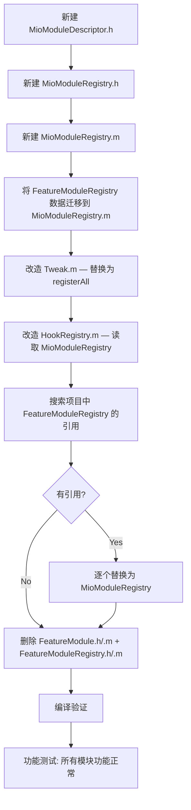

# 问题2 改造方案：双重注册机制统一

> **关联文档**: [MioPlugin_架构深度分析报告.md](file:///www/wwwroot/ios/MioPlugin_架构深度分析报告.md) — 问题2  
> **改造目标**: 消除 Tweak.m（注册 Config）与 FeatureModuleRegistry.m（注册 Hook）的两处手动同步，建立**单一注册源**  
> **方案类型**: 终极统一方案（非补丁）  
> **说明**: 本文档仅提供改造方案，不涉及实际代码修改。

---

## 一、现状分析

### 1.1 双注册路径

```
Tweak.m（Config 注册）          FeatureModuleRegistry.m（Hook 注册）
──────────────────────         ──────────────────────────────
[ConfigManager registerModule:  +allModules → @[
  RevokeConfig.class,              [moduleWithIdentifier:@"general"
  ClearUnreadConfig.class,           hookInstallerClasses:@[
  JokerConfig.class,                    [RevokeHook class],
  GroupExitConfig.class,                [ClearUnreadHook class],
  RedEnvelopConfig.class,               [JokerHook class],
  AutoTransferConfig.class,             [GroupExitHook class],
  ChatTopBarConfig.class,               [MessageTimeHook class],
  MessageTimeConfig.class,           ],
  UIPurifyConfig.class,             [moduleWithIdentifier:@"redenvelop"
  AttachLayoutConfig.class,           hookInstallerClasses:@[
  HideAvatarConfig.class,                 [RedEnvelopHook class],
  PlaceholderTextConfig.class,             [AutoTransferHook class],
  ListCornerRadiusConfig.class,         ],
  CardBgConfig.class,                 ... // 共 6 个 module 描述
]                                   ]]
```

### 1.2 核心问题

| 维度 | 具体问题 |
|------|---------|
| **手动同步** | 新增一个模块需在 **Tweak.m** 加 `registerModule:` + **FeatureModuleRegistry.m** 加 `hookInstallerClasses` |
| **遗漏风险** | 忘记任何一处 → Config 不加载 或 Hook 不安装，**无编译期检测** |
| **信息重复** | Config 与 Hook 的 1:1 映射关系在两个文件间隐性存在，没有任何显式关联 |
| **Tweak.m 冗余** | Tweak.m 除了注册 14 个 Config，还 import 了 `ListCornerRadiusHook.h` 和 `ProfileCardBgHook.h`（**仅为了注释说明**，见第 52 行） |

### 1.3 当前 Config ↔ Hook 映射

| # | Config 类 | Hook 类 | 归属分组 |
|---|-----------|---------|---------|
| 1 | RevokeConfig | RevokeHook | general |
| 2 | ClearUnreadConfig | ClearUnreadHook | general |
| 3 | JokerConfig | JokerHook | general |
| 4 | GroupExitConfig | GroupExitHook | general |
| 5 | MessageTimeConfig | MessageTimeHook | general |
| 6 | RedEnvelopConfig | RedEnvelopHook | redenvelop |
| 7 | AutoTransferConfig | AutoTransferHook | redenvelop |
| 8 | ListCornerRadiusConfig | ListCornerRadiusHook | listcorner |
| 9 | CardBgConfig | ProfileCardBgHook | listcorner |
| 10 | UIPurifyConfig | UIPurifyHook | layout |
| 11 | AttachLayoutConfig | UIAttachLayoutHook | layout |
| 12 | HideAvatarConfig | HideAvatarHook | layout |
| 13 | PlaceholderTextConfig | PlaceholderTextHook | layout |
| 14 | ChatTopBarConfig | ChatTopBarHook | layout |
| 15 | *(无 Config)* | SettingEntryHook | settingentry |

---

## 二、改造方案：统一模块注册中心

### 2.1 总体思路

创建一个 **`MioModuleRegistry`** 作为唯一的模块注册中心，同时持有 Config 类和 Hook 类的信息，并自动完成两者注册。Tweak.m 只需调用一次 `[MioModuleRegistry registerAll]`。

### 2.2 架构变化

```
                BEFORE                                  AFTER
┌─────────────────────────────┐         ┌──────────────────────────────────┐
│         Tweak.m             │         │           Tweak.m                │
│  [ConfigManager register:   │         │  [MioModuleRegistry registerAll] │
│    RevokeConfig.class, ...] │         │         (仅 1 行)                │
│  [ConfigManager loadAll]    │         └───────────┬──────────────────────┘
│  [HookRegistry installAll]  │                     │
└──────────┬────────────┬────-┘                     ▼
           │            │           ┌──────────────────────────────────┐
           ▼            ▼           │        MioModuleRegistry         │
┌─────────────┐  ┌─────────────┐    │  ┌─────────────────────────────┐ │
│ConfigManager│  │HookRegistry │    │  │ 统一描述符数组 (模块信息表)    │ │
│ (注册14模块) │  │(遍历注册表)  │    │  │ 含 Config 类 + Hook 类      │ │
└─────────────┘  └──────┬──────┘    │  │ + 设置页 Controller 等       │ │
                        │           │  └─────────────────────────────┘ │
                        ▼           │  + registerAll → 自动分流:       │
               ┌──────────────┐     │    → ConfigManager.register     │
               │FeatureModule │     │    → HookRegistry.install       │
               │Registry      │     └──────────────────────────────────┘
               │(6 个描述符)   │
               └──────────────┘
```

### 2.3 最终效果

**改造前**：新增一个模块需要修改 **3 处**：
1. `Tweak.m` — 加 `#import` + `registerModule:`
2. `FeatureModuleRegistry.m` — 加 `#import` + `hookInstallerClasses`
3. *(可能忘记某一步 → 无声失败)*

**改造后**：新增一个模块只需要修改 **1 处**：
1. `MioModuleRegistry.m` — 在数组中加一行描述符

---

## 三、详细设计

### 3.1 新建核心实体 `MioModuleDescriptor`

文件：`Registry/MioModuleDescriptor.h`

```objc
//
//  MioModuleDescriptor.h
//  MioPlugin
//
//  统一模块描述符。
//  同时承载 Config 类、Hook 类、设置页 Controller 类，
//  实现"一处注册，自动分流"。
//

#import <Foundation/Foundation.h>
#import <UIKit/UIKit.h>

NS_ASSUME_NONNULL_BEGIN

/// 统一模块描述符
/// 一个描述符 = 一个功能模块的全部信息
@interface MioModuleDescriptor : NSObject

/// 模块唯一标识符（如 @"revoke"）
@property (nonatomic, copy, readonly) NSString *identifier;

/// 模块标题（如 @"防撤回"）
@property (nonatomic, copy, readonly) NSString *title;

/// Config 类（符合 ConfigModule 协议，可选）
/// 若提供，registerAll 时会自动调用 [ConfigManager registerModule:]
@property (nonatomic, assign, readonly, nullable) Class configClass;

/// Hook 安装类列表（每个类需实现 + (void)install）
/// registerAll 时会自动逐个调用 +[install]
@property (nonatomic, copy, readonly) NSArray<Class> *hookClasses;

/// 设置页 Controller 类（可选，用于导航）
@property (nonatomic, assign, readonly, nullable) Class controllerClass;

/// 设置页副标题（可选，用于 UI 展示）
@property (nonatomic, copy, readonly, nullable) NSString *subtitle;

/// 所属分组标题（可选，用于 UI 分组）
@property (nonatomic, copy, readonly, nullable) NSString *sectionTitle;

/// 构造器
/// @param identifier   模块唯一标识符
/// @param title        模块标题
/// @param configClass  ConfigModule 类（传 nil 表示无 Config）
/// @param hookClasses  Hook 类数组（传 @[] 或 nil 表示无 Hook）
/// @param controllerClass 设置页 Controller（传 nil 表示无）
/// @param subtitle     副标题
/// @param sectionTitle 分组标题
+ (instancetype)descriptorWithIdentifier:(NSString *)identifier
                                   title:(NSString *)title
                              configClass:(nullable Class)configClass
                              hookClasses:(nullable NSArray<Class> *)hookClasses
                          controllerClass:(nullable Class)controllerClass
                                 subtitle:(nullable NSString *)subtitle
                              sectionTitle:(nullable NSString *)sectionTitle;
@end

NS_ASSUME_NONNULL_END
```

### 3.2 统一注册中心 `MioModuleRegistry`

文件：`Registry/MioModuleRegistry.h`

```objc
//
//  MioModuleRegistry.h
//  MioPlugin
//
//  统一模块注册中心。
//  替代 Tweak.m 的手动 Config 注册 + FeatureModuleRegistry。
//  所有模块信息集中在一个数组中，registerAll 自动分流到：
//    - ConfigManager（注册 Config）
//    - HookRegistry（安装 Hook）
//

#import <Foundation/Foundation.h>

NS_ASSUME_NONNULL_BEGIN

@interface MioModuleRegistry : NSObject

/// 获取所有模块描述符
+ (NSArray<MioModuleDescriptor *> *)allDescriptors;

/// 执行全量注册：
/// 1. 遍历所有模块，将 configClass 注册到 ConfigManager
/// 2. 调用 [ConfigManager loadAll]
/// 3. 安装所有模块的 hookClasses
+ (void)registerAll;

// ─────────── 以下方法与 FeatureModuleRegistry 兼容 ───────────

/// 获取所有分组标题（有序，用于设置页 UI）
+ (NSArray<NSString *> *)orderedSectionTitles;

/// 获取指定分组下的模块（用于设置页 UI）
+ (NSArray<MioModuleDescriptor *> *)descriptorsForSection:(NSString *)sectionTitle;

@end

NS_ASSUME_NONNULL_END
```

### 3.3 新注册中心的实现

文件：`Registry/MioModuleRegistry.m`

```objc
//
//  MioModuleRegistry.m
//  MioPlugin
//
//  唯一模块注册中心。
//  所有 import 集中在此文件，Tweak.m 不再需要任何模块 import。
//

#import "MioModuleRegistry.h"
#import "MioModuleDescriptor.h"

// ────── 所有 Config 类的 import ──────
#import "../Modules/Revoke/RevokeConfig.h"
#import "../Modules/Unread/ClearUnreadConfig.h"
#import "../Modules/Joker/JokerConfig.h"
#import "../Modules/GroupExit/GroupExitConfig.h"
#import "../Modules/RedEnvelop/RedEnvelopConfig.h"
#import "../Modules/AutoTransfer/AutoTransferConfig.h"
#import "../Modules/ChatTopBar/ChatTopBarConfig.h"
#import "../Modules/MessageTime/MessageTimeConfig.h"
#import "../Modules/Layout/UIPurifyConfig.h"
#import "../Modules/Layout/AttachLayoutConfig.h"
#import "../Modules/HideAvatar/HideAvatarConfig.h"
#import "../Modules/PlaceholderText/PlaceholderTextConfig.h"
#import "../Modules/ListCornerRadius/ListCornerRadiusConfig.h"
#import "../Modules/ProfileCardBg/CardBgConfig.h"

// ────── 所有 Hook 类的 import ──────
#import "../Modules/Revoke/RevokeHook.h"
#import "../Modules/Unread/ClearUnreadHook.h"
#import "../Modules/Joker/JokerHook.h"
#import "../Modules/GroupExit/GroupExitHook.h"
#import "../Modules/RedEnvelop/RedEnvelopHook.h"
#import "../Modules/AutoTransfer/AutoTransferHook.h"
#import "../Modules/ChatTopBar/ChatTopBarHook.h"
#import "../Modules/MessageTime/MessageTimeHook.h"
#import "../Modules/Layout/UIPurifyHook.h"
#import "../Modules/Layout/UIAttachLayoutHook.h"
#import "../Modules/HideAvatar/HideAvatarHook.h"
#import "../Modules/PlaceholderText/PlaceholderTextHook.h"
#import "../Modules/ListCornerRadius/ListCornerRadiusHook.h"
#import "../Modules/ProfileCardBg/ProfileCardBgHook.h"
#import "../Modules/SettingEntry/SettingEntryHook.h"

// ────── 设置页 Controller 的 import ──────
#import "../Settings/Controllers/SettingListCornerRadiusController.h"

// ────── 设置基类（多个 Controller 在同一文件声明） ──────
#import "../Settings/Common/SettingController.h"   // 内含 SettingGeneralFunctionController 等 10 个声明


@implementation MioModuleDescriptor

+ (instancetype)descriptorWithIdentifier:(NSString *)identifier
                                   title:(NSString *)title
                              configClass:(Class)configClass
                              hookClasses:(NSArray<Class> *)hookClasses
                          controllerClass:(Class)controllerClass
                                 subtitle:(NSString *)subtitle
                              sectionTitle:(NSString *)sectionTitle
{
    MioModuleDescriptor *d = [[self alloc] init];
    if (d) {
        d->_identifier = [identifier copy];
        d->_title = [title copy];
        d->_configClass = configClass;
        d->_hookClasses = [hookClasses copy] ?: @[];
        d->_controllerClass = controllerClass;
        d->_subtitle = [subtitle copy];
        d->_sectionTitle = [sectionTitle copy];
    }
    return d;
}

@end


@implementation MioModuleRegistry

#pragma mark - 唯一模块信息表

/// ★ 唯一真相源 ★
/// 新增模块：只需在此数组中追加一行。
/// 系统会自动完成 Config 注册 + Hook 安装。
+ (NSArray<MioModuleDescriptor *> *)allDescriptors {
    static NSArray<MioModuleDescriptor *> *descriptors = nil;
    static dispatch_once_t onceToken;
    dispatch_once(&onceToken, ^{
        descriptors = @[

            // ──── 通用功能 ────
            [MioModuleDescriptor descriptorWithIdentifier:@"revoke"
                                                    title:@"防撤回"
                                               configClass:[RevokeConfig class]
                                               hookClasses:@[[RevokeHook class]]
                                           controllerClass:[SettingGeneralFunctionController class]
                                                  subtitle:@"消息撤回拦截"
                                             sectionTitle:@"通用"],

            [MioModuleDescriptor descriptorWithIdentifier:@"unread"
                                                    title:@"未读清零"
                                               configClass:[ClearUnreadConfig class]
                                               hookClasses:@[[ClearUnreadHook class]]
                                           controllerClass:[SettingGeneralFunctionController class]
                                                  subtitle:@"消息未读管理"
                                             sectionTitle:@"通用"],

            [MioModuleDescriptor descriptorWithIdentifier:@"joker"
                                                    title:@"消息恶搞"
                                               configClass:[JokerConfig class]
                                               hookClasses:@[[JokerHook class]]
                                           controllerClass:[SettingGeneralFunctionController class]
                                                  subtitle:@"修改聊天消息内容"
                                             sectionTitle:@"通用"],

            [MioModuleDescriptor descriptorWithIdentifier:@"groupexit"
                                                    title:@"群退监控"
                                               configClass:[GroupExitConfig class]
                                               hookClasses:@[[GroupExitHook class]]
                                           controllerClass:[SettingGeneralFunctionController class]
                                                  subtitle:@"群聊退群提醒"
                                             sectionTitle:@"通用"],

            [MioModuleDescriptor descriptorWithIdentifier:@"messagetime"
                                                    title:@"消息时间"
                                               configClass:[MessageTimeConfig class]
                                               hookClasses:@[[MessageTimeHook class]]
                                           controllerClass:[SettingGeneralFunctionController class]
                                                  subtitle:@"自定义消息时间显示"
                                             sectionTitle:@"通用"],

            // ──── 自动抢红包 ────
            [MioModuleDescriptor descriptorWithIdentifier:@"redenvelop"
                                                    title:@"自动抢红包"
                                               configClass:[RedEnvelopConfig class]
                                               hookClasses:@[[RedEnvelopHook class],
                                                              [AutoTransferHook class]]
                                           controllerClass:[SettingRedEnvelopController class]
                                                  subtitle:@"自动领取红包、延迟设置"
                                             sectionTitle:@"通用"],

            [MioModuleDescriptor descriptorWithIdentifier:@"autotransfer"
                                                    title:@"自动转账"
                                               configClass:[AutoTransferConfig class]
                                               hookClasses:@[]           // ← RedEnvelopHook 已包含
                                           controllerClass:[SettingRedEnvelopController class]
                                                  subtitle:@"自动收款"
                                             sectionTitle:@"通用"],

            // ──── 界面布局 ────
            [MioModuleDescriptor descriptorWithIdentifier:@"uipurify"
                                                    title:@"界面净化"
                                               configClass:[UIPurifyConfig class]
                                               hookClasses:@[[UIPurifyHook class]]
                                           controllerClass:[SettingLayoutFunctionController class]
                                                  subtitle:@"隐藏界面元素"
                                             sectionTitle:@"通用"],

            [MioModuleDescriptor descriptorWithIdentifier:@"hideavatar"
                                                    title:@"隐藏头像"
                                               configClass:[HideAvatarConfig class]
                                               hookClasses:@[[HideAvatarHook class]]
                                           controllerClass:[SettingLayoutFunctionController class]
                                                  subtitle:@"隐藏聊天头像"
                                             sectionTitle:@"通用"],

            [MioModuleDescriptor descriptorWithIdentifier:@"attachlayout"
                                                    title:@"附件布局"
                                               configClass:[AttachLayoutConfig class]
                                               hookClasses:@[[UIAttachLayoutHook class]]
                                           controllerClass:[SettingLayoutFunctionController class]
                                                  subtitle:@"附件面板自定义"
                                             sectionTitle:@"通用"],

            [MioModuleDescriptor descriptorWithIdentifier:@"placeholdertext"
                                                    title:@"占位文本"
                                               configClass:[PlaceholderTextConfig class]
                                               hookClasses:@[[PlaceholderTextHook class]]
                                           controllerClass:[SettingLayoutFunctionController class]
                                                  subtitle:@"自定义占位文字"
                                             sectionTitle:@"通用"],

            [MioModuleDescriptor descriptorWithIdentifier:@"chattopbar"
                                                    title:@"聊天顶栏"
                                               configClass:[ChatTopBarConfig class]
                                               hookClasses:@[[ChatTopBarHook class]]
                                           controllerClass:[SettingLayoutFunctionController class]
                                                  subtitle:@"聊天界面顶部栏自定义"
                                             sectionTitle:@"通用"],

            // ──── 列表圆角 + 资料卡背景 ────
            [MioModuleDescriptor descriptorWithIdentifier:@"listcorner"
                                                    title:@"列表圆角"
                                               configClass:[ListCornerRadiusConfig class]
                                               hookClasses:@[[ListCornerRadiusHook class]]
                                           controllerClass:[SettingListCornerRadiusController class]
                                                  subtitle:@"Cell圆角、边距、边框样式"
                                             sectionTitle:@"通用"],

            [MioModuleDescriptor descriptorWithIdentifier:@"cardbg"
                                                    title:@"资料卡背景"
                                               configClass:[CardBgConfig class]
                                               hookClasses:@[[ProfileCardBgHook class]]
                                           controllerClass:[SettingCardBackgroundController class]
                                                  subtitle:@"资料卡片背景自定义"
                                             sectionTitle:@"通用"],

            // ──── 关于 ────
            [MioModuleDescriptor descriptorWithIdentifier:@"about"
                                                    title:@"关于"
                                               configClass:nil
                                               hookClasses:@[]
                                           controllerClass:[SettingAboutController class]
                                                  subtitle:@"插件信息"
                                             sectionTitle:@"更多"],

            // ──── 设置入口（无 Config + 无 Controller） ────
            [MioModuleDescriptor descriptorWithIdentifier:@"settingentry"
                                                    title:@"插件入口"
                                               configClass:nil
                                               hookClasses:@[[SettingEntryHook class]]
                                           controllerClass:nil
                                                  subtitle:@"设置页面入口"
                                             sectionTitle:@"系统"],
        ];
    });
    return descriptors;
}

#pragma mark - 注册执行

+ (void)registerAll {
    NSLog(@"[MioPlugin][ModuleRegistry] registerAll start");

    NSArray<MioModuleDescriptor *> *allModules = [self allDescriptors];

    // ── 第 1 步：注册所有 Config ──
    for (MioModuleDescriptor *module in allModules) {
        if (module.configClass) {
            [ConfigManager registerModule:module.configClass];
        }
    }

    // ── 第 2 步：加载配置 ──
    [ConfigManager loadAll];

    // ── 第 3 步：安装所有 Hook（自动去重） ──
    NSMutableSet<Class> *installedClasses = [NSMutableSet set];
    for (MioModuleDescriptor *module in allModules) {
        for (Class hookClass in module.hookClasses) {
            if (!hookClass || [installedClasses containsObject:hookClass]) continue;
            if ([hookClass respondsToSelector:@selector(install)]) {
                @try {
                    ((void (*)(id, SEL))objc_msgSend)(hookClass, @selector(install));
                    [installedClasses addObject:hookClass];
                    NSLog(@"[MioPlugin][ModuleRegistry] ✓ hook installed: %@", hookClass);
                } @catch (NSException *e) {
                    NSLog(@"[MioPlugin][ModuleRegistry] ✗ hook failed for %@: %@", hookClass, e);
                }
            }
        }
    }

    NSLog(@"[MioPlugin][ModuleRegistry] registerAll complete: %lu configs, %lu hooks",
          (unsigned long)allModules.count, (unsigned long)installedClasses.count);
}

#pragma mark - 兼容设置页 UI 方法

+ (NSArray<NSString *> *)orderedSectionTitles {
    return @[@"通用", @"更多", @"系统"];
}

+ (NSArray<MioModuleDescriptor *> *)descriptorsForSection:(NSString *)sectionTitle {
    if (sectionTitle.length == 0) return @[];
    NSMutableArray *result = [NSMutableArray array];
    for (MioModuleDescriptor *module in [self allDescriptors]) {
        if ([module.sectionTitle isEqualToString:sectionTitle]) {
            [result addObject:module];
        }
    }
    return result;
}

@end
```

### 3.4 Tweak.m 改造

```objc
// ── 改造前（35 行，import 21 个文件 + 14 行注册 + 2 行注释） ──

#import <UIKit/UIKit.h>
#import <Foundation/Foundation.h>
#import <objc/runtime.h>
#import "Registry/HookRegistry.h"
#import "Core/ConfigManager.h"
#import "Modules/Revoke/RevokeConfig.h"
#import "Modules/Unread/ClearUnreadConfig.h"
#import "Modules/Joker/JokerConfig.h"
#import "Modules/GroupExit/GroupExitConfig.h"
#import "Modules/RedEnvelop/RedEnvelopConfig.h"
#import "Modules/AutoTransfer/AutoTransferConfig.h"
#import "Modules/ChatTopBar/ChatTopBarConfig.h"
#import "Modules/MessageTime/MessageTimeConfig.h"
#import "Modules/Layout/UIPurifyConfig.h"
#import "Modules/Layout/AttachLayoutConfig.h"
#import "Modules/HideAvatar/HideAvatarConfig.h"
#import "Modules/PlaceholderText/PlaceholderTextConfig.h"
#import "Modules/ListCornerRadius/ListCornerRadiusConfig.h"
#import "Modules/ProfileCardBg/CardBgConfig.h"
#import "Modules/ListCornerRadius/ListCornerRadiusHook.h"
#import "Modules/ProfileCardBg/ProfileCardBgHook.h"

__attribute__((constructor))
static void MioPluginInitialize() {
    @try {
        @autoreleasepool {
            [ConfigManager registerModule:RevokeConfig.class];
            [ConfigManager registerModule:ClearUnreadConfig.class];
            // ... 14 行 ...
            [ConfigManager registerModule:CardBgConfig.class];

            [ConfigManager loadAll];
            [HookRegistry installAllHooks];

            // ★ ProfileCardBgHook 已通过 FeatureModuleRegistry 注册
            // installAllHooks 会自动调用其 +install 方法，不再需要显式调用
        }
    } @catch (NSException *e) { ... }
}


// ── 改造后（5 行，干净整洁） ──

#import <UIKit/UIKit.h>
#import <Foundation/Foundation.h>
#import "Registry/MioModuleRegistry.h"

__attribute__((constructor))
static void MioPluginInitialize() {
    @try {
        @autoreleasepool {
            [MioModuleRegistry registerAll];     // ← 一行完成全部注册
        }
    } @catch (NSException *e) {
        NSLog(@"[MioPlugin] ✗ CONSTRUCTOR EXCEPTION: %@ - %@\n%@",
              e.name, e.reason, e.callStackSymbols);
    }
}
```

---

## 四、改造操作清单

### 4.1 文件变化总表

| 操作 | 文件路径 | 说明 |
|------|---------|------|
| **新建** | `Registry/MioModuleDescriptor.h` | 统一模块描述符实体 |
| **新建** | `Registry/MioModuleRegistry.h` | 统一注册中心接口 |
| **新建** | `Registry/MioModuleRegistry.m` | 统一注册中心实现（含所有 import + 模块信息表） |
| **修改** | `Tweak.m` | 删除 14 行 import + 14 行 registerModule + HookRegistry 调用，替换为 1 行 `[MioModuleRegistry registerAll]` |
| **删除** | `Registry/FeatureModuleRegistry.h` | 被 MioModuleRegistry 替代 |
| **删除** | `Registry/FeatureModuleRegistry.m` | 被 MioModuleRegistry 替代 |
| **删除** | `Registry/FeatureModule.h` | 被 MioModuleDescriptor.h 替代 |
| **可选删除** | `Registry/HookRegistry.h` | 可删除或保留为空壳（逻辑已移至 MioModuleRegistry） |
| **可选删除** | `Registry/HookRegistry.m` | 同上 |

### 4.2 Tweak.m 逐行改造对照

```objc
// ★ 改造前 (Tweak.m) ★
// 第1-2行: 系统 import（保留）
#import <UIKit/UIKit.h>
#import <Foundation/Foundation.h>

// 第3行: objc/runtime.h → 不再需要（可以删除）
#import <objc/runtime.h>
// 如果其他地方使用 objc 运行时，可以保留

// 第4-5行: HookRegistry.h + ConfigManager.h → 不再需要直接 import
// ★ 改为:
#import "Registry/MioModuleRegistry.h"
// 删除:
-  #import "Registry/HookRegistry.h"
-  #import "Core/ConfigManager.h"

// 第6-21行: 14 个 Config .h + 2 个 Hook .h → 全部删除
-  #import "Modules/Revoke/RevokeConfig.h"
-  #import "Modules/Unread/ClearUnreadConfig.h"
-  #import "Modules/Joker/JokerConfig.h"
-  ...
-  #import "Modules/ProfileCardBg/CardBgConfig.h"
-  #import "Modules/ListCornerRadius/ListCornerRadiusHook.h"
-  #import "Modules/ProfileCardBg/ProfileCardBgHook.h"

// 第23-60行: 构造函数体 → 精简为
// ★ 改造后:
__attribute__((constructor))
static void MioPluginInitialize() {
    @try {
        @autoreleasepool {
            [MioModuleRegistry registerAll];  // ← 唯一需要的一行
        }
    } @catch (NSException *e) {
        NSLog(@"[MioPlugin] ✗ CONSTRUCTOR EXCEPTION: %@ - %@\n%@",
              e.name, e.reason, e.callStackSymbols);
    }
}
```

### 4.3 FeatureModuleRegistry -> MioModuleRegistry 数据迁移

原 FeatureModuleRegistry.m 中 6 个模块的字段要逐一对齐到新描述符：

```
原 FeatureModuleDescriptor 字段     →  新 MioModuleDescriptor 字段
───────────────────────────────       ──────────────────────────────
identifier                          →  identifier
title                               →  title
subtitle                            →  subtitle
sectionTitle                        →  sectionTitle
controllerClass                     →  controllerClass
hookInstallerClasses                →  hookClasses
(无)                                →  configClass (新增，核心变化)
```

**关键变化**：原 `FeatureModuleDescriptor` 没有 `configClass` 字段。新增此字段后，模块信息表中的每一行同时告诉系统"这个模块的 Config 是什么"和"这个模块的 Hook 是什么"，从根源上消除两处同步。

### 4.4 迁移后的模块信息表

| identifier | configClass | hookClasses | controllerClass | sectionTitle |
|-----------|------------|-------------|-----------------|--------------|
| revoke | RevokeConfig | [RevokeHook] | SettingGeneralFunctionController | 通用 |
| unread | ClearUnreadConfig | [ClearUnreadHook] | SettingGeneralFunctionController | 通用 |
| joker | JokerConfig | [JokerHook] | SettingGeneralFunctionController | 通用 |
| groupexit | GroupExitConfig | [GroupExitHook] | SettingGeneralFunctionController | 通用 |
| messagetime | MessageTimeConfig | [MessageTimeHook] | SettingGeneralFunctionController | 通用 |
| redenvelop | RedEnvelopConfig | [RedEnvelopHook, AutoTransferHook] | SettingRedEnvelopController | 通用 |
| autotransfer | AutoTransferConfig | — | SettingRedEnvelopController | 通用 |
| uipurify | UIPurifyConfig | [UIPurifyHook] | SettingLayoutFunctionController | 通用 |
| hideavatar | HideAvatarConfig | [HideAvatarHook] | SettingLayoutFunctionController | 通用 |
| attachlayout | AttachLayoutConfig | [UIAttachLayoutHook] | SettingLayoutFunctionController | 通用 |
| placeholdertext | PlaceholderTextConfig | [PlaceholderTextHook] | SettingLayoutFunctionController | 通用 |
| chattopbar | ChatTopBarConfig | [ChatTopBarHook] | SettingLayoutFunctionController | 通用 |
| listcorner | ListCornerRadiusConfig | [ListCornerRadiusHook] | SettingListCornerRadiusController | 通用 |
| cardbg | CardBgConfig | [ProfileCardBgHook] | SettingCardBackgroundController | 通用 |
| about | *(nil)* | — | SettingAboutController | 更多 |
| settingentry | *(nil)* | [SettingEntryHook] | *(nil)* | 系统 |

---

## 五、依赖关系分析

### 5.1 谁依赖 FeatureModuleRegistry？

依赖方可能需要同步更新：

| 依赖方 | 变化 |
|-------|------|
| `HookRegistry.m`（第 2 行 `#import "FeatureModuleRegistry.h"`） | 若保留 HookRegistry，改为 import MioModuleRegistry.h 并从那里读取 |
| `SettingCategoryController.m`（假设使用） | 若引用了 `[FeatureModuleRegistry orderedSectionTitles]`，改为 `[MioModuleRegistry orderedSectionTitles]` |
| `SettingController.m`（假设使用） | 同上 |

**最小改动方案**：
- 在 `MioModuleRegistry` 中提供与 `FeatureModuleRegistry` **相同的方法签名**
- 这样所有调用方不需要修改，只需改 import 即可

### 5.2 兼容性方法

```objc
// MioModuleRegistry 向下兼容 FeatureModuleRegistry 的方法

// 原：[FeatureModuleRegistry allModules] 返回 NSArray<FeatureModuleDescriptor *>
// 新调用方直接用 [MioModuleRegistry allDescriptors]

// 原：[FeatureModuleRegistry modulesForSection:@"通用"]  
// 新：[MioModuleRegistry descriptorsForSection:@"通用"]

// 原：[FeatureModuleRegistry orderedSectionTitles]
// 新：[MioModuleRegistry orderedSectionTitles]
```

若调用方直接使用 `FeatureModuleDescriptor` 类型，需改为 `MioModuleDescriptor`。

### 5.3 删除旧文件后的完整性检查

删除 `FeatureModule.h/.m` + `FeatureModuleRegistry.h/.m` 后，搜索整个项目确认无残留引用：

```bash
# 在项目根目录执行
grep -rn "FeatureModule" --include="*.m" --include="*.h" .
# 应返回 0 结果（除已删除的文件外）
```

---

## 六、改造前后对比

### 6.1 代码量对比

| 指标 | 改造前 | 改造后 |
|------|--------|--------|
| 注册相关文件数 | 5 个（Tweak.m + FeatureModule.h/.m + HookRegistry.h/.m） | **2 个**（Tweak.m + MioModuleDescriptor.h + MioModuleRegistry.h/.m） |
| Tweak.m 行数 | 60 行 | **~20 行** |
| Tweak.m import 数 | 21 个 | **1 个** |
| 注册逻辑集中度 | 分散在 3 个文件 | **1 个数组** |
| 新增模块需改文件数 | 2 处（Tweak.m + FeatureModuleRegistry.m） | **1 处**（MioModuleRegistry.m 数组加一行） |
| 新增模块需 import 数 | 每个 import 文件 + 1（Tweak.m）+ 每个 hook 文件 + 1（FeatureModuleRegistry.m） | **0**（MioModuleRegistry.m 已全部导入） |

### 6.2 错误预防效果

| 场景 | 改造前 | 改造后 |
|------|--------|--------|
| 忘记注册 Config | 运行时无声失败，配置不生效 | **不可能**——同一行包含 configClass |
| 忘记注册 Hook | 运行时无声失败，功能不生效 | **不可能**——同一行包含 hookClasses |
| Config 与 Hook 不对应 | 手动维护，全靠代码审查 | **编译期关联**——在同一个 descriptor 中 |
| 新增模块漏 import | 编译错误（找不到类） | **不可能**——MioModuleRegistry.m 已全部 import |

### 6.3 使用新模块开发流程

开发者要新增一个模块（如"自动翻译"），只需：

**步骤 1**：在 `Modules/AutoTranslate/` 下创建 `AutoTranslateConfig.h/.m` + `AutoTranslateHook.h/.m`

**步骤 2**：在 `MioModuleRegistry.m` 中（即此文件）添加一行：

```objc
[MioModuleDescriptor descriptorWithIdentifier:@"autotranslate"
                                        title:@"自动翻译"
                                   configClass:[AutoTranslateConfig class]
                                   hookClasses:@[[AutoTranslateHook class]]
                               controllerClass:[SettingLayoutFunctionController class]
                                      subtitle:@"聊天消息自动翻译"
                                 sectionTitle:@"通用"],
```

**完成。** 不需要修改 Tweak.m，不需要修改任何其他文件。

---

## 七、附录：可能的问题与处理

### 7.1 原有的 HookRegistry 是否还有存在的必要？

**推荐保留**，保持关注分离。改造后的 HookRegistry 读取 MioModuleRegistry 的数据：

```objc
// HookRegistry.m 改造后
#import "HookRegistry.h"
#import "MioModuleRegistry.h"
#import "MioModuleDescriptor.h"
#import <objc/message.h>

@implementation HookRegistry

+ (void)installAllHooks {
    NSMutableSet<Class> *installedClasses = [NSMutableSet set];

    for (MioModuleDescriptor *module in [MioModuleRegistry allDescriptors]) {
        for (Class hookClass in module.hookClasses) {
            if (!hookClass || [installedClasses containsObject:hookClass]) continue;
            if ([hookClass respondsToSelector:@selector(install)]) {
                @try {
                    ((void (*)(id, SEL))objc_msgSend)(hookClass, @selector(install));
                    [installedClasses addObject:hookClass];
                } @catch (NSException *e) {
                    NSLog(@"[MioPlugin][HookRegistry] ✗ %@: %@", hookClass, e);
                }
            }
        }
    }
}

@end
```

然后 MioModuleRegistry 的 `registerAll` 中可以调用：

```objc
+ (void)registerAll {
    // 注册 Config...
    for (MioModuleDescriptor *module in [self allDescriptors]) {
        if (module.configClass) [ConfigManager registerModule:module.configClass];
    }
    [ConfigManager loadAll];
    // 安装 Hook（委托给 HookRegistry）
    [HookRegistry installAllHooks];
}
```

这样职责分明：**MioModuleRegistry 负责编排**，**HookRegistry 负责 Hook 安装**。

### 7.2 旧调用方兼容

如果项目中其他地方直接使用了 `[FeatureModuleRegistry allModules]`，需要在改造后改为 `[MioModuleRegistry allDescriptors]`。需要搜索：

```bash
grep -rn "FeatureModuleRegistry" --include="*.m" --include="*.h" .
```

### 7.3 设置页面展示逻辑

如果设置 UI 需要展示模块列表（controllerClass + title + subtitle），MioModuleDescriptor 的 `controllerClass` 和 `title`/`subtitle` 可直接使用。调用方示例：

```objc
// 设置页展示某个分组下的模块
NSArray *modules = [MioModuleRegistry descriptorsForSection:@"通用"];
for (MioModuleDescriptor *module in modules) {
    // module.title → 显示标题
    // module.subtitle → 显示副标题
    // module.controllerClass → 点击后跳转
}
```

---

## 八、执行步骤



| 步骤 | 操作 | 涉及文件 |
|------|------|---------|
| 1 | 创建 MioModuleDescriptor.h | 新建 |
| 2 | 创建 MioModuleRegistry.h | 新建 |
| 3 | 创建 MioModuleRegistry.m | 新建，将全部 import + 模块数据集中至此 |
| 4 | 改造 Tweak.m | 删除 18 行 import + 15 行注册 + 2 行注释 → 1 行 registerAll |
| 5 | 改造 HookRegistry.m | 改为从 MioModuleRegistry 读取数据 |
| 6 | 更新其他引用方 | 逐一替换 `FeatureModuleRegistry` → `MioModuleRegistry` |
| 7 | 删除旧文件 | `FeatureModule.h`、`FeatureModule.m`、`FeatureModuleRegistry.h`、`FeatureModuleRegistry.m` |
| 8 | 编译验证 | `make clean && make`，确保零 warning |
| 9 | 功能测试 | 验证所有 14 个 Config 加载正常 + 所有 Hook 安装正常 |

---

*文档结束*