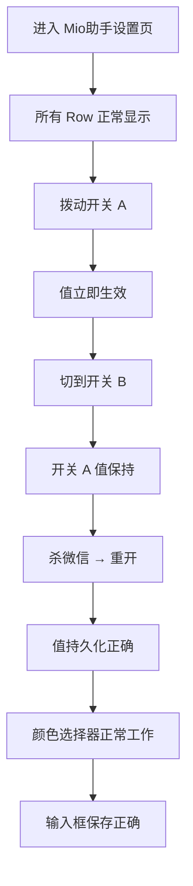

# 问题3 改造方案：ConfigManager 单键访问缓存优化

> **关联文档**: [MioPlugin\_架构深度分析报告.md](file:///www/wwwroot/ios/MioPlugin_架构深度分析报告.md)\
> **改造目标**: 消除 `valueForKey:` / `setValue:forKey:` 的 O(n×m) 全量遍历，替换为 O(1) 字典缓存查找\
> **涉及文件**: 仅修改 [ConfigManager.m](file:///www/wwwroot/ios/MioPlugin/Core/ConfigManager.m)，**不修改任何调用方**\
> **方案类型**: 终极方案（一次性根治，无需未来维护）\
> **说明**: 本文档仅提供改造方案，不涉及实际代码修改。

***

## 一、现状分析

### 1.1 当前实现

```objc
// ConfigManager.m — 当前实现 (第 109~131 行)

+ (void)setValue:(id)value forKey:(NSString *)key {
    for (Class<ConfigModule> cls in s_registeredModules) {     // ← O(n): 14 个模块
        id instance = [cls shared];
        for (ConfigDescriptor *desc in [cls descriptors]) {    // ← O(m): ~5~20 个描述器
            if ([desc.key isEqualToString:key]) {              // ← 字符串遍历匹配
                [instance setValue:value forKey:key];
                return;                                        // ← 找到就返回
            }
        }
    }
    // 找不到则静默失败
}

+ (id)valueForKey:(NSString *)key {
    for (Class<ConfigModule> cls in s_registeredModules) {     // ← 同上 O(n×m)
        id instance = [cls shared];
        for (ConfigDescriptor *desc in [cls descriptors]) {
            if ([desc.key isEqualToString:key]) {
                return [instance valueForKey:key];
            }
        }
    }
    return nil;                                                // ← 找不到返回 nil
}
```

### 1.2 性能分析

**当前规模估算**：

| 模块                     |   描述器数   |
| ---------------------- | :------: |
| RevokeConfig           |   \~10   |
| ClearUnreadConfig      |    \~5   |
| JokerConfig            |    \~5   |
| GroupExitConfig        |    \~3   |
| RedEnvelopConfig       |   \~10   |
| AutoTransferConfig     |    \~3   |
| ChatTopBarConfig       |    \~6   |
| MessageTimeConfig      |    \~5   |
| UIPurifyConfig         |    \~8   |
| AttachLayoutConfig     |    \~5   |
| HideAvatarConfig       |    \~3   |
| PlaceholderTextConfig  |    \~3   |
| ListCornerRadiusConfig |   \~10   |
| CardBgConfig           |   \~20   |
| **合计**                 | **\~96** |

**每次** **`valueForKey:`** **调用的工作量**：

- 最坏情况（key 在最后一个模块的最后一个描述器）：**96 次迭代 + 96 次字符串比较**
- 平均情况（key 在中间位置）：**\~48 次迭代**
- 找不到（key 不存在）：**96 次迭代**

**典型调用频率**（SettingCategoryController.m + SettingEntryHook.m 共约 26 处调用）：

| 场景                     |             调用数            |     总迭代量（当前）     |
| ---------------------- | :------------------------: | :--------------: |
| 设置页面加载（每个 row 读取值）     |           6\~12 次          | \~288 \~ \~576 次 |
| 用户操作一个开关               | 2 次 setValue + saveAll 内遍历 |   \~192 + \~192  |
| 颜色选择器打开                |     2\~4 次 valueForKey     |   \~96 \~ \~192  |
| SettingEntryHook.m 运行时 |             4 次            |       \~192      |

### 1.3 问题本质

**无缓存**：每次 `valueForKey:` / `setValue:forKey:` 都从头遍历所有模块 × 所有描述器。同一个 key 在同一页面生命周期内可能被反复查询多次，每次都是 O(n×m)。

***

## 二、改造方案：静态索引缓存

### 2.1 方案设计

```Objective-C
flowchart LR
    subgraph 改造前
        A1[valueForKey: @"revokeEnabled"] --> A2[遍历 14 个模块]
        A2 --> A3[遍历每个模块的 descriptors]
        A3 --> A4[字符串匹配 desc.key]
        A4 -->|找到| A5[返回 value]
        A4 -->|未找到| A2
    end

    subgraph 改造后
        B1[valueForKey: @"revokeEnabled"] --> B2[s_keyIndex 字典]
        B2 -->|O(1) 哈希| B3[拿到 moduleClass + descriptor]
        B3 -->|KVC| B5[返回 value]
    end
```

**核心思路**：在 `registerModule:` 时建立一次索引，之后所有单键访问走哈希表。

### 2.2 数据结构

```objc
/**
 * 配置键索引缓存。
 *
 * key:   ConfigDescriptor 的本地 key（如 @"revokeEnabled"）
 * value: 包含 moduleClass 和 descriptor 的轻量结构体
 *
 * 冲突处理: 第一个注册的模块优先（与当前遍历顺序行为一致）
 * 生命周期: 随模块注册自动构建，程序运行期间不变
 */
static NSMutableDictionary<NSString *, NSDictionary *> *s_keyIndex = nil;
```

### 2.3 改造后完整代码

```objc
// ── ConfigManager.m 改造后 ────────────────────────────────────────────

#import "ConfigManager.h"

NSString *const kPluginPrefix = @"MioPlugin_";

static NSMutableArray<Class<ConfigModule>> *s_registeredModules = nil;

/**
 * ★ 新增: 配置键索引缓存
 * 映射: configKey → @{@"class": moduleClass, @"descriptor": descriptor}
 *
 * 在 registerModule: 时增量构建，valueForKey: / setValue:forKey: 时 O(1) 访问。
 * 无需重复遍历，无需惰性初始化，无需过期/清理。
 */
static NSMutableDictionary<NSString *, NSDictionary *> *s_keyIndex = nil;

@implementation ConfigManager

// ─────────────────────────────────────────────────────────────────
// 注册与索引构建
// ─────────────────────────────────────────────────────────────────

+ (void)registerModule:(Class<ConfigModule>)moduleClass {
    // 1. 模块列表
    if (!s_registeredModules) {
        s_registeredModules = [NSMutableArray array];
    }
    if (![s_registeredModules containsObject:moduleClass]) {
        [s_registeredModules addObject:moduleClass];
    }

    // 2. ★ 新增: 建立 key → {class, descriptor} 索引
    if (!s_keyIndex) {
        s_keyIndex = [NSMutableDictionary dictionary];
    }
    for (ConfigDescriptor *desc in [moduleClass descriptors]) {
        // 只索引尚未注册的 key（第一个注册的模块优先）
        if (s_keyIndex[desc.key] == nil) {
            s_keyIndex[desc.key] = @{
                @"class":      moduleClass,
                @"descriptor": desc
            };
        }
    }
}

// ─────────────────────────────────────────────────────────────────
// 批量操作（不变，仍遍历所有模块）
// ─────────────────────────────────────────────────────────────────

+ (void)loadAll {
    for (Class<ConfigModule> cls in s_registeredModules) {
        id instance = [cls shared];
        for (ConfigDescriptor *desc in [cls descriptors]) {
            NSString *fullKey = [kPluginPrefix stringByAppendingFormat:@"%@%@",
                                 [cls modulePrefix], desc.key];
            NSUserDefaults *d = [NSUserDefaults standardUserDefaults];
            id raw = [d objectForKey:fullKey];

            if (raw) {
                switch (desc.type) {
                    case ConfigValueTypeBool:
                        [instance setValue:@([raw boolValue]) forKey:desc.key];
                        break;
                    case ConfigValueTypeInteger:
                        [instance setValue:@([raw integerValue]) forKey:desc.key];
                        break;
                    case ConfigValueTypeFloat:
                        [instance setValue:@([raw floatValue]) forKey:desc.key];
                        break;
                    case ConfigValueTypeString:
                        [instance setValue:([(NSString *)raw length] > 0 ? raw : desc.defaultValue)
                                   forKey:desc.key];
                        break;
                    case ConfigValueTypeArray:
                        [instance setValue:(raw ?: desc.defaultValue) forKey:desc.key];
                        break;
                }
            } else {
                [instance setValue:desc.defaultValue forKey:desc.key];
            }
        }

        // 特殊处理：NSKeyedArchiver 类型
        if ([cls respondsToSelector:@selector(loadArchivedData)]) {
            [cls loadArchivedData];
        }
    }
}

+ (void)saveAll {
    NSUserDefaults *d = [NSUserDefaults standardUserDefaults];

    for (Class<ConfigModule> cls in s_registeredModules) {
        id instance = [cls shared];
        for (ConfigDescriptor *desc in [cls descriptors]) {
            NSString *fullKey = [kPluginPrefix stringByAppendingFormat:@"%@%@",
                                 [cls modulePrefix], desc.key];
            id value = [instance valueForKey:desc.key];

            if (value) {
                switch (desc.type) {
                    case ConfigValueTypeBool:
                        [d setBool:[value boolValue] forKey:fullKey];
                        break;
                    case ConfigValueTypeInteger:
                        [d setInteger:[value integerValue] forKey:fullKey];
                        break;
                    case ConfigValueTypeFloat:
                        [d setFloat:[value floatValue] forKey:fullKey];
                        break;
                    case ConfigValueTypeString:
                        [d setObject:value forKey:fullKey];
                        break;
                    case ConfigValueTypeArray:
                        [d setObject:value forKey:fullKey];
                        break;
                }
            } else {
                [d removeObjectForKey:fullKey];
            }
        }

        if ([cls respondsToSelector:@selector(saveArchivedData)]) {
            [cls saveArchivedData];
        }
    }

    [d synchronize];
}

+ (void)resetAll {
    NSUserDefaults *d = [NSUserDefaults standardUserDefaults];
    NSDictionary *all = [d dictionaryRepresentation];
    for (NSString *key in all) {
        if ([key hasPrefix:kPluginPrefix]) {
            [d removeObjectForKey:key];
        }
    }
    [d synchronize];
    [self loadAll];
}

// ─────────────────────────────────────────────────────────────────
// 单键访问（★ 改造：从 O(n×m) 降为 O(1)）
// ─────────────────────────────────────────────────────────────────

+ (void)setValue:(id)value forKey:(NSString *)key {
    // 查索引: O(1)
    NSDictionary *entry = s_keyIndex[key];
    if (!entry) {
        // 找不到 key 时静默失败（与当前行为一致）
        WPLogDebug(@"ConfigManager", @"setValue:forKey: key not found: %@", key);
        return;
    }

    Class<ConfigModule> cls = entry[@"class"];
    [[cls shared] setValue:value forKey:key];
}

+ (id)valueForKey:(NSString *)key {
    // 查索引: O(1)
    NSDictionary *entry = s_keyIndex[key];
    if (!entry) {
        // 找不到 key 时返回 nil（与当前行为一致）
        return nil;
    }

    Class<ConfigModule> cls = entry[@"class"];
    return [[cls shared] valueForKey:key];
}

@end
```

***

## 三、改造前后对比

### 3.1 性能对比

| 指标                       |    改造前    |             改造后             |     提升     |
| ------------------------ | :-------: | :-------------------------: | :--------: |
| `valueForKey:` 时间复杂度     | **O(96)** |           **O(1)**          | **\~96 倍** |
| `setValue:forKey:` 时间复杂度 | **O(96)** |           **O(1)**          | **\~96 倍** |
| 字符串比较次数（单次调用）            |   \~48 次  |        **0 次**（哈希查找）        |      —     |
| 设置页首次加载总迭代量              |  \~576 次  |   **\~1**（仅 loadAll 遍历一次）   |      —     |
| 索引构建开销                   |   **无**   | **1 次**（registerModule 时顺便） |     可忽略    |

### 3.2 代码变化

| 指标                     |             改造前            |            改造后            |
| ---------------------- | :------------------------: | :-----------------------: |
| 静态变量数                  | 1 个（`s_registeredModules`） |  **2 个**（+ `s_keyIndex`）  |
| `registerModule:` 复杂度  |            仅列表追加           |   列表追加 + 索引构建（**+9 行**）   |
| `valueForKey:` 代码行     |         12 行（双重循环）         |     **4 行**（索引查 + KVC）    |
| `setValue:forKey:` 代码行 |         12 行（双重循环）         | **5 行**（索引查 + KVC + 调试日志） |
| 调用方修改                  |           **0 个**          |          **0 个**          |

### 3.3 行为变化

| 场景                        |       改造前      |                     改造后                    |
| ------------------------- | :------------: | :----------------------------------------: |
| key 存在                    |     遍历找到后返回    |              字典查到后返回，**结果相同**              |
| key 不存在                   |    遍历完返回 nil   |            字典查到 nil 返回，**结果相同**            |
| key 冲突（两个模块有同名的 desc.key） |   第一个注册的模块胜出   |             第一个注册的模块胜出，**结果相同**            |
| 后注册的同名 key 被忽略            | 自然忽略（已 return） | 显式检查 `s_keyIndex[key] == nil` 才注册，**结果相同** |

***

## 四、与 loadAll 的关系

### 4.1 索引不是 loadAll 的替代

索引 **只解决单键访问**（`valueForKey:` / `setValue:forKey:`），`loadAll` 仍然需要遍历所有模块 × 描述器做全量加载。这是合理的：

| 操作                 |   需要遍历吗？  | 原因                        |
| ------------------ | :-------: | ------------------------- |
| `loadAll`          |    ✅ 必须   | 全量从 NSUserDefaults 读到内存中  |
| `saveAll`          |    ✅ 必须   | 全量从内存写到 NSUserDefaults 中  |
| `resetAll`         |    ✅ 必须   | 全量清空 NSUserDefaults 再重新加载 |
| `valueForKey:`     | **❌ 不需要** | 只是读取内存中的单个属性              |
| `setValue:forKey:` | **❌ 不需要** | 只是写入内存中的单个属性              |

### 4.2 索引的生命周期

```
Tweak.m __attribute__((constructor))
  │
  ├─ [ConfigManager registerModule:RevokeConfig.class]
  │     └→ s_keyIndex[@"revokeEnabled"]   = {RevokeConfig.class, desc}
  │     └→ s_keyIndex[@"revokeNotifyType"] = {RevokeConfig.class, desc}
  │     └→ ...
  │
  ├─ [ConfigManager registerModule:CardBgConfig.class]
  │     └→ s_keyIndex[@"cardBgMaterialEnabled"] = {CardBgConfig.class, desc}
  │     └→ ...
  │
  ├─ [ConfigManager loadAll]     ← 14 个模块全部注册完毕，索引完整
  │
  └─ [MioModuleRegistry registerAll]
        └→ 各 Hook 运行时调用:
             [ConfigManager valueForKey:@"revokeEnabled"]  → O(1) 查索引
             [ConfigManager setValue:@(YES) forKey:@"..."] → O(1) 查索引
```

**关键时序**：所有 `registerModule:` 在 `loadAll` 之前执行完毕 → 索引在第一个 `valueForKey:` 被调用前已经完整构建。

***

## 五、改造后 ConfigManager.m 文件总结

### 5.1 文件结构

```objc
// ── 静态变量 ──
NSString *const kPluginPrefix = @"MioPlugin_";
static NSMutableArray<Class<ConfigModule>> *s_registeredModules;   // 模块列表
static NSMutableDictionary *s_keyIndex;                             // ★ 新增: 索引缓存

// ── ConfigManager 实现 ──

+ (void)registerModule:       // 注册 + 增量构建 s_keyIndex
+ (void)loadAll                // 不变（全量遍历）
+ (void)saveAll                // 不变（全量遍历）
+ (void)resetAll               // 不变（全量遍历）
+ (void)setValue:forKey:       // ★ 改造: 查 s_keyIndex → KVC
+ (id)valueForKey:             // ★ 改造: 查 s_keyIndex → KVC
```

### 5.2 只改了一个文件

**只变**: `ConfigManager.m`
**不变**: `ConfigManager.h`、所有 14 个 Config 模块、所有 26 处调用方

***

## 六、执行步骤

|  步骤 | 操作                                                                   | 说明         |
| :-: | -------------------------------------------------------------------- | ---------- |
|  1  | 在 `s_registeredModules` 声明下方新增 `s_keyIndex` 静态字典声明                   | 两行代码       |
|  2  | 在 `registerModule:` 末尾新增索引构建循环（检查 `s_keyIndex[desc.key] == nil` 防冲突） | +9 行       |
|  3  | 替换 `valueForKey:` 为索引查 + KVC                                         | 12 行 → 4 行 |
|  4  | 替换 `setValue:forKey:` 为索引查 + KVC（加找不到的 WPLogDebug）                   | 12 行 → 6 行 |
|  5  | `make clean && make` 编译验证                                            | —          |
|  6  | 安装到设备运行冒烟测试                                                          | —          |

### 6.1 Git 变更预览

```diff
// ConfigManager.m
+static NSMutableDictionary<NSString *, NSDictionary *> *s_keyIndex = nil;

 + (void)registerModule:(Class<ConfigModule>)moduleClass {
     // ... 原有逻辑不变 ...
++    // 构建 key → {class, descriptor} 索引
++    if (!s_keyIndex) s_keyIndex = [NSMutableDictionary dictionary];
++    for (ConfigDescriptor *desc in [moduleClass descriptors]) {
++        if (s_keyIndex[desc.key] == nil) {
++            s_keyIndex[desc.key] = @{
++                @"class":      moduleClass,
++                @"descriptor": desc
++            };
++        }
++    }
 }

 + (void)setValue:(id)value forKey:(NSString *)key {
--    for (Class<ConfigModule> cls in s_registeredModules) {
--        id instance = [cls shared];
--        for (ConfigDescriptor *desc in [cls descriptors]) {
--            if ([desc.key isEqualToString:key]) {
--                [instance setValue:value forKey:key];
--                return;
--            }
--        }
--    }
++    NSDictionary *entry = s_keyIndex[key];
++    if (!entry) { WPLogDebug(...); return; }
++    [[entry[@"class"] shared] setValue:value forKey:key];
 }

 + (id)valueForKey:(NSString *)key {
--    for (Class<ConfigModule> cls in s_registeredModules) {
--        id instance = [cls shared];
--        for (ConfigDescriptor *desc in [cls descriptors]) {
--            if ([desc.key isEqualToString:key]) {
--                return [instance valueForKey:key];
--            }
--        }
--    }
--    return nil;
++    NSDictionary *entry = s_keyIndex[key];
++    return entry ? [[entry[@"class"] shared] valueForKey:key] : nil;
 }
```

***

## 七、测试方案

### 第 1 层：编译验证

```bash
make clean && make
```

### 第 2 层：功能正确性验证

所有单键访问**行为不变**，无需改调用方，所以测试重点是：

| 测试场景      | 操作                                                        | 验证                |
| --------- | --------------------------------------------------------- | ----------------- |
| 读已有 key   | `[ConfigManager valueForKey:@"revokeEnabled"]`            | 返回正确的值（YES/NO）    |
| 读不存在的 key | `[ConfigManager valueForKey:@"nonexistentKey"]`           | 返回 nil            |
| 写已有 key   | `[ConfigManager setValue:@(YES) forKey:@"revokeEnabled"]` | 值被正确更新            |
| 写不存在 key  | `[ConfigManager setValue:@(NO) forKey:@"nonexistentKey"]` | 静默忽略，不崩溃          |
| 读冲突 key   | 假设两个模块都有 @"enabled" key                                   | 返回第一个注册模块的值（同旧行为） |

### 第 3 层：设置页功能回归



### 第 4 层：稳定性

```
1. 快速重复开关同一个开关 20 次（模拟用户高频操作）
   → 不崩溃，每次值正确更新

2. 在设置页和各功能 Hook 之间反复切换
   → ConfigManager.valueForKey 始终返回正确值

3. 查看 Debug 日志:
   WPLogDebug(@"ConfigManager", @"setValue:forKey: key not found: ...")
   → 预期没有此类日志（所有 key 都应存在于索引中）
```

### 第 5 层：特别关注

由于 `s_keyIndex` 是静态字典，在 `registerModule:` 中构建。**重点验证**：

```
1. 所有 14 个 Config 模块是否都在 registerModule: 中被注册？
   如果某个模块在 loadAll 之后才注册，它的 key 不会被索引，
   valueForKey:/setValue:forKey: 会找不到该模块的 key。
   → 检查 Tweak.m 的 registerModule 调用是否覆盖全部 14 个模块
   → 当前 Tweak.m 应有 14 行 [ConfigManager registerModule:...]
```

***

## 八、与现有代码的兼容性

### 8.1 不需要修改的

| 文件                                    | 原因        |
| ------------------------------------- | --------- |
| `ConfigManager.h`                     | 公开 API 不变 |
| 所有 14 个 Config 模块                     | 协议实现不变    |
| `SettingCategoryController.m`（22 处调用） | 调用方式不变    |
| `SettingEntryHook.m`（4 处调用）           | 调用方式不变    |
| `Tweak.m`                             | 注册顺序不变    |

### 8.2 无侵入性

- **不改 API 签名**：`valueForKey:` / `setValue:forKey:` 的入参和返回完全不变
- **不改行为语义**：key 冲突时第一个注册的胜出（兼容）
- **不改时序依赖**：索引在 `registerModule:` 时构建，`loadAll` 前已完整

***

## 九、后续优化方向（非本次改造范围）

| 方向       | 方案                                                       | 价值                          |
| -------- | -------------------------------------------------------- | --------------------------- |
| 索引持久化    | 把 s\_keyIndex 内容编译期生成（通过宏或脚本），避免运行时构建                    | 节省 14 次 descriptors 遍历（已很小） |
| 类型安全 KVC | 用 `@property` getter/setter 替代 `valueForKey:` KVC        | 编译期类型检查                     |
| 并发安全     | 在 `registerModule:` 加 `dispatch_once` / `os_unfair_lock` | 如果将来支持动态模块加载                |

***

*文档结束*
