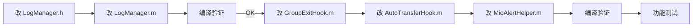

# 问题4 根治方案：日志系统全面统一

> **关联文档**: [MioPlugin_架构深度分析报告.md](file:///www/wwwroot/ios/MioPlugin_架构深度分析报告.md)  
> **改造目标**: 从根源上消除"两种日志 API + 两个日志文件"的问题，建立**一套 API、一个文件**的统一日志体系  
> **方案类型**: 终极根治方案  
> **说明**: 本文档仅提供改造方案，不涉及实际代码修改。

---

## 一、现状：双 API + 双文件

当前日志体系有两条完全独立的路径：

```
路径1: WPLog 宏                路径2: appendLineWithTag 方法
─────────────────────          ─────────────────────────────
#define WPLog(tag, fmt, ...)    + (void)appendLineWithTag:(tag)
    NSString *_msg = ...            content:(NSString *)line
    NSLog(@"...")
    [writeTag:tag content:_msg]  → 直接文件写入（无 NSLog）
  → 写入 plugin.log              → 写入 MioPlugin.log
```

| 维度 | WPLog 宏 | appendLineWithTag 方法 |
|------|:--------:|:---------------------:|
| 使用方式 | 宏（变参） | 方法 + NSString 手动拼接 |
| NSLOG | 有 | 无 |
| 目标文件 | `plugin.log` | `MioPlugin.log` |
| 时间戳格式 | `[NSDate date]` 默认格式 | `yyyy-MM-dd HH:mm:ss` |
| 调用方 | 32 个文件 | 3 个文件 |

**根本问题**：日志体系被分成两套 API 和两个文件，新增模块的开发者需要判断"用哪个 API"，排查问题需要"看哪个文件"。

---

## 二、根治方案：一套 API 写入一个文件

### 2.1 方案设计

```
改造前                             改造后
──────                             ──────
WPLog(tag, fmt, ...)               WPLog(tag, fmt, ...)      ← NSLog + 写入文件
  ├─ NSLog                          WPLogDebug(tag, fmt, ...) ← 只写入文件（无 NSLog）
  └─ writeTag → plugin.log          └─ 都通过 appendLineWithTag → MioPlugin.log

[_WPLogManager appendLineWithTag:   [_WPLogManager appendLineWithTag:
    tag content:fmt_string]              tag content:msg]
  └─ MioPlugin.log                  └─ MioPlugin.log（唯一文件）

                                    新增: WPLogDebug 宏
                                    删除: writeTag 方法
                                    删除: logFilePath（plugin.log）
                                    删除: 所有 [_WPLogManager appendLineWithTag:]
                                                     ↑ 改为 WPLogDebug
```

### 2.2 最终状态

| 指标 | 改造前 | 改造后 |
|------|:----:|:----:|
| **日志 API 种数** | **2 种**（宏 + 方法） | **1 种**（都是 `WPLog*` 宏） |
| **日志文件数** | **2 个**（plugin.log + MioPlugin.log） | **1 个**（MioPlugin.log） |
| **写入方法数** | **2 个**（writeTag + appendLineWithTag） | **1 个**（appendLineWithTag） |
| **文件路径定义数** | **2 处**（logFilePath + appendLineWithTag 内联） | **1 处**（静态 C 函数） |
| **时间戳格式化** | **2 种** | **1 种** |
| **调用方用法** | 混乱（宏 vs 方法） | **统一**（全是宏） |

---

## 三、API 设计

### 3.1 两个宏的语义区分

```objc
/**
 * 普通日志：同时输出到控制台 + 文件。
 * 用于重要的功能日志（如"防撤回触发"、"自动抢红包成功"）。
 */
#define WPLog(tag, fmt, ...) \
    do { \
        NSString *_msg = [NSString stringWithFormat:(fmt), ##__VA_ARGS__]; \
        NSLog(@"[%@] %@", (tag), _msg); \
        [_WPLogManager appendLineWithTag:(tag) content:_msg]; \
    } while(0)

/**
 * 调试日志：仅写入文件，不输出到控制台。
 * 用于高频调试日志（如群成员遍历、弹窗生命周期跟踪），
 * 避免在控制台刷屏，但仍保留到日志文件中供排查。
 */
#define WPLogDebug(tag, fmt, ...) \
    do { \
        NSString *_msg = [NSString stringWithFormat:(fmt), ##__VA_ARGS__]; \
        [_WPLogManager appendLineWithTag:(tag) content:_msg]; \
    } while(0)
```

**核心思想**：
- **`WPLog`** = 开发者需要看到的 + 用户反馈需要查到的
- **`WPLogDebug`** = 只有排查问题时才需要看的详细调试信息

### 3.2 改造后的 LogManager.h

```objc
//
//  LogManager.h
//  MioPlugin
//
//  统一日志管理。
//
//  提供两种日志宏，全部写入同一个文件：
//    Documents/MioPlugin_Logs/MioPlugin.log
//
//  用法:
//    WPLog(@"Revoke", @"消息已拦截: %@", msgId);      // 控制台 + 文件
//    WPLogDebug(@"GroupExit", @"旧成员: %lu", count); // 仅文件
//

#import <Foundation/Foundation.h>

/// 普通日志：控制台 + 文件
/// @param tag  模块标识（如 @"Revoke" / @"AutoTransfer"）
/// @param fmt  格式化字符串，后接变参
#define WPLog(tag, fmt, ...) \
    do { \
        NSString *_msg = [NSString stringWithFormat:(fmt), ##__VA_ARGS__]; \
        NSLog(@"[%@] %@", (tag), _msg); \
        [_WPLogManager appendLineWithTag:(tag) content:_msg]; \
    } while(0)

/// 调试日志：仅文件，不输出到控制台
/// 适用于高频调试信息，避免刷屏
/// @param tag  模块标识
/// @param fmt  格式化字符串，后接变参
#define WPLogDebug(tag, fmt, ...) \
    do { \
        NSString *_msg = [NSString stringWithFormat:(fmt), ##__VA_ARGS__]; \
        [_WPLogManager appendLineWithTag:(tag) content:_msg]; \
    } while(0)

@interface _WPLogManager : NSObject

/**
 * 追加一条日志到统一文件（MioPlugin.log）。
 * 格式: [2026-06-10 14:30:22][Tag] 内容
 *
 * 注意: 通常情况下不要直接调用此方法。
 * 普通日志请使用 WPLog() 宏，调试日志请使用 WPLogDebug() 宏。
 */
+ (void)appendLineWithTag:(NSString *)tag content:(NSString *)line;

@end
```

### 3.3 改造后的 LogManager.m

```objc
//
//  LogManager.m
//  MioPlugin
//
//  统一日志实现。
//  所有日志通过 WPLog / WPLogDebug 宏进入此文件，
//  统一写入 Documents/MioPlugin_Logs/MioPlugin.log。
//

#import "LogManager.h"

/// 统一日志文件路径
/// 返回: .../Documents/MioPlugin_Logs/MioPlugin.log
/// 自动创建目录，dispatch_once 保证线程安全
static NSString *WPLogFilePath(void) {
    static NSString *_logPath = nil;
    static dispatch_once_t onceToken;
    dispatch_once(&onceToken, ^{
        NSArray *paths = NSSearchPathForDirectoriesInDomains(
            NSDocumentDirectory, NSUserDomainMask, YES);
        NSString *folder = [paths.firstObject
            stringByAppendingPathComponent:@"MioPlugin_Logs"];
        [[NSFileManager defaultManager] createDirectoryAtPath:folder
                                  withIntermediateDirectories:YES
                                                   attributes:nil
                                                        error:nil];
        _logPath = [folder stringByAppendingPathComponent:@"MioPlugin.log"];
    });
    return _logPath;
}

/// 向统一日志文件追加一行
/// 格式: [2026-06-10 14:30:22][Tag] 内容\n
static void WPLogAppendLine(NSString *tag, NSString *content) {
    @try {
        // 时间戳
        NSDateFormatter *formatter = [[NSDateFormatter alloc] init];
        formatter.dateFormat = @"yyyy-MM-dd HH:mm:ss";
        NSString *timestamp = [formatter stringFromDate:[NSDate date]];

        // 构造行
        NSString *line = [NSString stringWithFormat:@"[%@][%@] %@\n",
                          timestamp, tag, content];

        // 追加写入
        NSString *filePath = WPLogFilePath();
        NSFileHandle *handle = [NSFileHandle fileHandleForWritingAtPath:filePath];
        if (handle) {
            [handle seekToEndOfFile];
            [handle writeData:[line dataUsingEncoding:NSUTF8StringEncoding]];
            [handle closeFile];
        } else {
            [line writeToFile:filePath atomically:YES
                     encoding:NSUTF8StringEncoding error:nil];
        }
    } @catch (NSException *e) {
        // 日志写入失败不抛异常
    }
}

@implementation _WPLogManager

+ (void)appendLineWithTag:(NSString *)tag content:(NSString *)line {
    // WPLog 和 WPLogDebug 宏都最终调用此方法
    // 这是项目中唯一的日志写入方法
    WPLogAppendLine(tag, line);
}

@end
```

---

## 四、调用方改造

### 4.1 修改清单

| 文件 | 位置 | 改造前 | 改造后 |
|------|------|--------|--------|
| [GroupExitHook.m](file:///www/wwwroot/ios/MioPlugin/Modules/GroupExit/GroupExitHook.m) | 第 112 行 | `[_WPLogManager appendLineWithTag:@"GroupExit" content:[NSString stringWithFormat:...]]` | `WPLogDebug(@"GroupExit", ...)` |
| GroupExitHook.m | 第 122 行 | 同上 | `WPLogDebug(@"GroupExit", ...)` |
| GroupExitHook.m | 第 132 行 | 同上 | `WPLogDebug(@"GroupExit", ...)` |
| GroupExitHook.m | 第 137 行 | 同上 | `WPLogDebug(@"GroupExit", ...)` |
| [AutoTransferHook.m](file:///www/wwwroot/ios/MioPlugin/Modules/AutoTransfer/AutoTransferHook.m) | 第 84 行 | `[_WPLogManager appendLineWithTag:@"AutoTransfer" content:[NSString stringWithFormat:...]]` | `WPLogDebug(@"AutoTransfer", ...)` |
| AutoTransferHook.m | 第 241 行 | 同上 | `WPLogDebug(@"AutoTransfer", ...)` |
| AutoTransferHook.m | 第 245 行 | 同上 | `WPLogDebug(@"AutoTransfer", ...)` |
| AutoTransferHook.m | 第 253 行 | 同上 | `WPLogDebug(@"AutoTransfer", ...)` |
| [MioAlertHelper.m](file:///www/wwwroot/ios/MioPlugin/Core/MioAlertHelper.m) | 第 30 行 ~ 第 184 行 | `[_WPLogManager appendLineWithTag:@"Alert" content:...]` × **26 处** | `WPLogDebug(@"Alert", ...)` × 26 处 |

### 4.2 转换规则

所有 `appendLineWithTag:` 调用的转换都是机械化的：

```
旧的写法:
  [_WPLogManager appendLineWithTag:@"Tag"
      content:[NSString stringWithFormat:@"fmt %@ %lu", arg1, arg2]];

新的写法:
  WPLogDebug(@"Tag", @"fmt %@ %lu", arg1, arg2);
```

**三要素**：
| 旧代码元素 | 新代码位置 |
|-----------|-----------|
| `[_WPLogManager appendLineWithTag:` | 删除 |
| `content:[NSString stringWithFormat:` | 删除 |
| `@"]` 结尾的 `]` | 删除 |
| `tag` 字符串 | 移到宏的第一个参数 |
| `fmt` 字符串 + 参数列表 | 移到宏的第二+参数 |
| 最外层 `];` | 宏用完后加 `;` |

### 4.3 GroupExitHook.m 逐行改造对照

```objc
// ── 改造前 ────────────────────────────────────────────────────
// 第 112 行
    [_WPLogManager appendLineWithTag:@"GroupExit" content:[NSString stringWithFormat:
        @"%@ setter called, old=%@, new=%lu",
        chatRoomName,
        oldMemberList ? [NSString stringWithFormat:@"%lu", (unsigned long)oldMemberList.length] : @"nil",
        (unsigned long)newMemberList.length]];

// ── 改造后 ────────────────────────────────────────────────────
    WPLogDebug(@"GroupExit", @"%@ setter called, old=%@, new=%lu",
        chatRoomName,
        oldMemberList ? [NSString stringWithFormat:@"%lu", (unsigned long)oldMemberList.length] : @"nil",
        (unsigned long)newMemberList.length);


// ── 改造前 ────────────────────────────────────────────────────
// 第 122 行
        [_WPLogManager appendLineWithTag:@"GroupExit" content:[NSString stringWithFormat:
            @"%@ members: %lu -> %lu",
            chatRoomName, (unsigned long)oldMembers.count, (unsigned long)newMembers.count]];

// ── 改造后 ────────────────────────────────────────────────────
        WPLogDebug(@"GroupExit", @"%@ members: %lu -> %lu",
            chatRoomName, (unsigned long)oldMembers.count, (unsigned long)newMembers.count);


// ── 改造前 ────────────────────────────────────────────────────
// 第 132 行
            [_WPLogManager appendLineWithTag:@"GroupExit" content:[NSString stringWithFormat:
                @"%@ exit detected, diff count=%lu",
                chatRoomName, (unsigned long)oldSet.count]];

// ── 改造后 ────────────────────────────────────────────────────
            WPLogDebug(@"GroupExit", @"%@ exit detected, diff count=%lu",
                chatRoomName, (unsigned long)oldSet.count);


// ── 改造前 ────────────────────────────────────────────────────
// 第 137 行
                [_WPLogManager appendLineWithTag:@"GroupExit" content:[NSString stringWithFormat:
                    @"Processing exitUserId: '%@', length=%lu",
                    exitUserId, (unsigned long)exitUserId.length]];

// ── 改造后 ────────────────────────────────────────────────────
                WPLogDebug(@"GroupExit", @"Processing exitUserId: '%@', length=%lu",
                    exitUserId, (unsigned long)exitUserId.length);
```

### 4.4 AutoTransferHook.m 逐行改造对照

```objc
// ── 改造前（第 84 行）──
    [_WPLogManager appendLineWithTag:@"AutoTransfer" content:[NSString stringWithFormat:
        @"自动回复已发送: %@ -> %@", replyText, sessionUserName]];

// ── 改造后 ──
    WPLogDebug(@"AutoTransfer", @"自动回复已发送: %@ -> %@", replyText, sessionUserName);


// ── 改造前（第 241 行）──
    [_WPLogManager appendLineWithTag:@"AutoTransfer" content:[NSString stringWithFormat:
        @"检测到转账: transferID=%@ from=%@ fee=%lld memo=%@ isGroup=%d",
        transferID, fromUsr, feeAmount, payMemo, isGroup]];

// ── 改造后 ──
    WPLogDebug(@"AutoTransfer", @"检测到转账: transferID=%@ from=%@ fee=%lld memo=%@ isGroup=%d",
        transferID, fromUsr, feeAmount, payMemo, isGroup);


// ── 改造前（第 245 行）──
    [_WPLogManager appendLineWithTag:@"AutoTransfer" content:[NSString stringWithFormat:
        @"[DEBUG] XML字段: total_fee=%@ feedesc=%@ paysubtype=%@ bubbletype=%@ invalidtime=%@",
        extractXMLValue(content, @"total_fee") ?: @"(nil)",
        ...]];

// ── 改造后 ──
    WPLogDebug(@"AutoTransfer", @"[DEBUG] XML字段: total_fee=%@ feedesc=%@ paysubtype=%@ "
         @"bubbletype=%@ invalidtime=%@",
        extractXMLValue(content, @"total_fee") ?: @"(nil)",
        ...);


// ── 改造前（第 253 行）──
    [_WPLogManager appendLineWithTag:@"AutoTransfer" content:[NSString stringWithFormat:
        @"[DEBUG] ObjC属性: payInfoItem=%@ m_uiTransferAmount=%@ m_total_fee=%@",
        payInfoItem ? @"可用" : @"nil",
        payInfoItem ? [payInfoItem valueForKey:@"m_uiTransferAmount"] ?: @"(nil)" : @"(N/A)",
        payInfoItem ? [payInfoItem valueForKey:@"m_total_fee"] ?: @"(nil)" : @"(N/A)"]];

// ── 改造后 ──
    WPLogDebug(@"AutoTransfer", @"[DEBUG] ObjC属性: payInfoItem=%@ m_uiTransferAmount=%@ m_total_fee=%@",
        payInfoItem ? @"可用" : @"nil",
        payInfoItem ? [payInfoItem valueForKey:@"m_uiTransferAmount"] ?: @"(nil)" : @"(N/A)",
        payInfoItem ? [payInfoItem valueForKey:@"m_total_fee"] ?: @"(nil)" : @"(N/A)");
```

### 4.5 MioAlertHelper.m 逐行改造对照

MioAlertHelper.m 有 26 处调用，都是 `WPLogDebug(@"Alert", ...)` 转换。这里展示每一处：

**文件顶部的 C IMP 函数：**

```objc
// 第 30 行
// OLD: [_WPLogManager appendLineWithTag:@"Alert" content:@"CONFIRM CALLBACK FIRED..."];
// NEW: WPLogDebug(@"Alert", @"CONFIRM CALLBACK FIRED (C IMP on WCUIAlertView)");

// 第 33 行
// OLD: [_WPLogManager appendLineWithTag:@"Alert" content:[NSString stringWithFormat:...]];
// NEW: WPLogDebug(@"Alert", @"   self=%@ confirmBlock=%s", self, confirmBlock ? "YES" : "NO");

// 第 39 行
// OLD: [_WPLogManager appendLineWithTag:@"Alert" content:[NSString stringWithFormat:...]];
// NEW: WPLogDebug(@"Alert", @"   tipsVc.tipsTextView.text = %@", input ?: @"(nil)");

// 第 41 行
// OLD: [_WPLogManager appendLineWithTag:@"Alert" content:[NSString stringWithFormat:...]];
// NEW: WPLogDebug(@"Alert", @"   tipsVc.textView error: %@", e);

// 第 46 行
// OLD: [_WPLogManager appendLineWithTag:@"Alert" content:[NSString stringWithFormat:...]];
// NEW: WPLogDebug(@"Alert", @"   tipsVc.tipsTextField.text = %@", input ?: @"(nil)");

// 第 53 行
// OLD: [_WPLogManager appendLineWithTag:@"Alert" content:[NSString stringWithFormat:...]];
// NEW: WPLogDebug(@"Alert", @"   getTextFieldText = %@", input ?: @"(nil)");

// 第 57 行
// OLD: [_WPLogManager appendLineWithTag:@"Alert" content:[NSString stringWithFormat:...]];
// NEW: WPLogDebug(@"Alert", @"   FINAL input: [%@] len=%lu", input ?: @"(nil)", (unsigned long)(input ? input.length : 0));

// 第 60 行
// OLD: [_WPLogManager appendLineWithTag:@"Alert" content:@"   → calling confirmBlock..."];
// NEW: WPLogDebug(@"Alert", @"   → calling confirmBlock...");

// 第 62 行
// OLD: [_WPLogManager appendLineWithTag:@"Alert" content:@"   → confirmBlock returned"];
// NEW: WPLogDebug(@"Alert", @"   → confirmBlock returned");

// 第 64 行
// OLD: [_WPLogManager appendLineWithTag:@"Alert" content:[NSString stringWithFormat:...]];
// NEW: WPLogDebug(@"Alert", @"   skip: input=%lu confirm=%s", ...);

// 第 75 行
// OLD: [_WPLogManager appendLineWithTag:@"Alert" content:@"__walert_confirm C IMP injected..."];
// NEW: WPLogDebug(@"Alert", @"__walert_confirm C IMP injected into WCUIAlertView");

// 第 83 行
// OLD: [_WPLogManager appendLineWithTag:@"Alert" content:@"__walert_simple_confirm C IMP injected..."];
// NEW: WPLogDebug(@"Alert", @"__walert_simple_confirm C IMP injected into WCUIAlertView");

// 第 93 行
// OLD: [_WPLogManager appendLineWithTag:@"Alert" content:...];
// NEW: WPLogDebug(@"Alert", @"%@", _alertClass ? @"WCUIAlertView class found" : @"WCUIAlertView class NOT found");

// 第 104 行
// OLD: [_WPLogManager appendLineWithTag:@"Alert" content:@"WCUIAlertView not available — abort"];
// NEW: WPLogDebug(@"Alert", @"WCUIAlertView not available — abort");

// 第 110 行
// OLD: [_WPLogManager appendLineWithTag:@"Alert" content:@"alloc+initWithTitle: Mio助手"];
// NEW: WPLogDebug(@"Alert", @"alloc+initWithTitle: Mio助手");

// 第 112 行
// OLD: if (!alert) { [_WPLogManager appendLineWithTag:@"Alert" content:@"init nil"]; return; }
// NEW: if (!alert) { WPLogDebug(@"Alert", @"init nil"); return; }

// 第 113 行
// OLD: [_WPLogManager appendLineWithTag:@"Alert" content:[NSString stringWithFormat:@"   alert=%@", alert]];
// NEW: WPLogDebug(@"Alert", @"   alert=%@", alert);

// 第 119 行 + 第 120 行
// OLD:  [_WPLogManager appendLineWithTag:@"Alert" content:@"showTextFieldWithMaxLen available"];
// NEW:  WPLogDebug(@"Alert", @"showTextFieldWithMaxLen available");
// OLD:  } else { [_WPLogManager appendLineWithTag:@"Alert" content:@"showTextFieldWithMaxLen NOT found"]; }
// NEW:  } else { WPLogDebug(@"Alert", @"showTextFieldWithMaxLen NOT found"); }

// 第 127 行 + 第 128 行
// OLD:  [_WPLogManager appendLineWithTag:@"Alert" content:@"setTextFieldDefaultText available"];
// NEW:  WPLogDebug(@"Alert", @"setTextFieldDefaultText available");
// OLD:  } else { [_WPLogManager appendLineWithTag:@"Alert" content:@"setTextFieldDefaultText NOT found"]; }
// NEW:  } else { WPLogDebug(@"Alert", @"setTextFieldDefaultText NOT found"); }

// 第 135 行
// OLD:  [_WPLogManager appendLineWithTag:@"Alert" content:@"addCancelBtnTitle available"];
// NEW:  WPLogDebug(@"Alert", @"addCancelBtnTitle available");

// 第 148 行
// OLD:  [_WPLogManager appendLineWithTag:@"Alert" content:@"addBtnTitle:target:sel:..."];
// NEW:  WPLogDebug(@"Alert", @"addBtnTitle:target:sel: (target=alert, sel=__walert_confirm) available");

// 第 155 行
// OLD:  [_WPLogManager appendLineWithTag:@"Alert" content:@"show available — alert displayed"];
// NEW:  WPLogDebug(@"Alert", @"show available — alert displayed");

// 第 158 行
// OLD:  [_WPLogManager appendLineWithTag:@"Alert" content:[NSString stringWithFormat:...]];
// NEW:  WPLogDebug(@"Alert", @"EXCEPTION: %@", e);

// 第 181 行
// OLD:  [_WPLogManager appendLineWithTag:@"Alert" content:@"tip shown: Mio助手"];
// NEW:  WPLogDebug(@"Alert", @"tip shown: Mio助手");

// 第 184 行
// OLD:  [_WPLogManager appendLineWithTag:@"Alert" content:[NSString stringWithFormat:...]];
// NEW:  WPLogDebug(@"Alert", @"tip error: %@", e);
```

---

## 五、文件变化总表

### 5.1 改动统计

| 操作 | 文件 | 改动量 |
|------|------|:-----:|
| **改** | `Core/LogManager.h` | 加 10 行（WPLogDebug 宏），保持 WPLog 不变 |
| **改** | `Core/LogManager.m` | 重写为 1 个方法 + 2 个 C 函数，删除 writeTag/logFilePath |
| **改** | `Modules/GroupExit/GroupExitHook.m` | 4 处 `[_WPLogManager appendLineWithTag:]` → `WPLogDebug(` |
| **改** | `Modules/AutoTransfer/AutoTransferHook.m` | 4 处 `[_WPLogManager appendLineWithTag:]` → `WPLogDebug(` |
| **改** | `Core/MioAlertHelper.m` | 26 处 `[_WPLogManager appendLineWithTag:]` → `WPLogDebug(` |
| **不** | 其他 32 个 WPLog 调用方 | 完全不需要改 |
| **不** | `LogManager.h` 的 WPLog 宏 | 签名和行为完全不变 |

### 5.2 LogManager.h 差异对比

```objc
// ── 改造前 ──

#define WPLog(tag, fmt, ...) \
    do { \
        NSString *_msg = [NSString stringWithFormat:(fmt), ##__VA_ARGS__]; \
        NSLog(@"[%@] %@", (tag), _msg); \
        [_WPLogManager writeTag:(tag) content:_msg];    // ← writeTag → plugin.log
    } while(0)

@interface _WPLogManager : NSObject
+ (void)writeTag:(NSString *)tag content:(NSString *)content;             // ← 将删除
+ (void)appendLineWithTag:(NSString *)tag content:(NSString *)line;
@end


// ── 改造后 ──

#define WPLog(tag, fmt, ...) \
    do { \
        NSString *_msg = [NSString stringWithFormat:(fmt), ##__VA_ARGS__]; \
        NSLog(@"[%@] %@", (tag), _msg); \
        [_WPLogManager appendLineWithTag:(tag) content:_msg];   // ← 改为 appendLineWithTag
    } while(0)

// ★ 新增: 调试日志宏
#define WPLogDebug(tag, fmt, ...) \
    do { \
        NSString *_msg = [NSString stringWithFormat:(fmt), ##__VA_ARGS__]; \
        [_WPLogManager appendLineWithTag:(tag) content:_msg];   // ← 仅文件, 无 NSLog
    } while(0)

@interface _WPLogManager : NSObject
// writeTag 方法已删除, 所有写入统一走 appendLineWithTag
+ (void)appendLineWithTag:(NSString *)tag content:(NSString *)line;
@end
```

### 5.3 LogManager.m 差异对比

```objc
// ── 改造前 ──                         // ── 改造后 ──
                                          static NSString *WPLogFilePath(void) {
                                              // → MioPlugin.log
+ (NSString *)logFilePath {               }
    // → plugin.log
}                                         static void WPLogAppendLine(tag, content) {
                                              // 统一的时间戳 + 写入
+ (void)writeTag:(tag) content:(msg) {    }
    // → plugin.log, 不同时间戳
}                                         @implementation _WPLogManager

+ (void)appendLineWithTag:... {           + (void)appendLineWithTag:... {
    // → MioPlugin.log, 另一时间戳             WPLogAppendLine(tag, line);
}                                         }
                                          @end
```

**代码行数**: 64 行 → 约 50 行（净减约 14 行, 去掉 2 个方法 + 1 个路径 + 1 份格式化）

---

## 六、执行步骤



### Step 1~2: 改 LogManager.h + LogManager.m

直接替换为 3.2 节 + 3.3 节的完整代码。

### Step 3: 首次编译验证

```bash
cd /www/wwwroot/ios/MioPlugin && make clean && make
```

可能出现的错误：

```
error: 'writeTag:' is not found
→ WPLog 宏内调用了 writeTag，需要改为 appendLineWithTag
```

```
error: use of undeclared identifier 'WPLogDebug'
→ WPLogDebug 宏未在 .m 文件前被 import，
  检查 LogManager.h 是否确实被模块 import （当前已通过 Prefix 或直接 import）
```

### Step 4~6: 转换三个文件的 appendLineWithTag 调用

按照第四章的逐行对照，将 GroupExitHook.m、AutoTransferHook.m、MioAlertHelper.m 中的所有 `[_WPLogManager appendLineWithTag:...]` 替换为 `WPLogDebug(...)`。

### Step 7: 最终编译验证

```bash
cd /www/wwwroot/ios/MioPlugin && make clean && make
```

确认零 warning。

### Step 8: 功能测试

按照第七章的测试方案执行。

---

## 七、测试方案

### 7.1 编译测试

```bash
make clean && make
```

### 7.2 安装后：日志写入验证

```bash
# 在设备 SSH 中
cat /var/mobile/Documents/MioPlugin_Logs/MioPlugin.log
```

**验证项目**:

| 验证 | 操作 | 预期 |
|------|------|------|
| WPLog 写入 | 触发防撤回 | `[时间][Revoke] ...` |
| WPLogDebug 写入 | 触发 GroupExit 成员变更 | `[时间][GroupExit] ...` |
| WPLogDebug 写入 | 触发 AutoTransfer | `[时间][AutoTransfer] ...` |
| WPLogDebug 写入 | 触发弹窗 | `[时间][Alert] ...` |
| 所有日志在同一文件 | 查看 MioPlugin.log 同时含有 `[Revoke]`, `[GroupExit]`, `[AutoTransfer]`, `[Alert]` 等 | |

### 7.3 无 console 刷屏验证

打开 Xcode 控制台 / idevicesyslog，触发高频 GroupExit 日志：

```
❌ 之前: 大量 "[GroupExit] Processing exitUserId: 'wx_xxx', length=28" 刷屏
✅ 之后: WPLogDebug 不输出到 console, 控制台干净
```

### 7.4 重要日志验证

WPLog 的正常日志仍然输出到 console：

```
[AutoTransfer] [REPLY] 自动回复异常: ...
[GroupExit] [GroupExit] Skipping empty exitUserId
```
这些是 WPLog (不是 WPLogDebug), 应正常出现在 console。

### 7.5 回归验证

```
1. 发消息 → 撤回 → 确认 Revoke WPLog 在 console + 文件中
2. 进入大群 → 确认 GroupExit WPLogDebug 仅在文件中, 不在 console
3. 触发 Alert → 确认 Alerts WPLogDebug 仅在文件中
4. 杀微信 → 重开 → 文件持续追加, 不丢失
```

---

## 八、迁移后的编码规范

改造完成后，团队约定以下规范：

### 何时用 WPLog

```objc
// ✅ 用户操作感知到的
WPLog(@"Revoke", @"消息已拦截: %@", msgId);
WPLog(@"RedEnvelop", @"已抢红包: %@", packetId);

// ✅ 异常/错误
WPLog(@"AutoTransfer", @"[REPLY] 自动回复异常: %@", e);

// ✅ 重要的逻辑分支
WPLog(@"GroupExit", @"[GroupExit] Skipping empty exitUserId");
```

### 何时用 WPLogDebug

```objc
// ✅ 高频循环内的详细跟踪
WPLogDebug(@"GroupExit", @"Processing exitUserId: '%@', length=%lu", ...);

// ✅ 变量值的详细 dump
WPLogDebug(@"AutoTransfer", @"[DEBUG] XML字段: total_fee=%@", ...);

// ✅ 弹窗/页面生命周期的每一步
WPLogDebug(@"Alert", @"showTextFieldWithMaxLen available");
```

### 绝对禁止

```objc
// ❌ 直接调用 _WPLogManager appendLineWithTag:
[_WPLogManager appendLineWithTag:@"Tag" content:...];
```

所有调用方都必须使用 `WPLog()` 或 `WPLogDebug()` 宏。

---

## 九、最终效果预览

### 改造后数据流

```
WPLog(@"GroupExit", @"exit detected")    WPLogDebug(@"GroupExit", @"member=%lu", count)
        │                                          │
        │                                          │
        ▼                                          ▼
   NSLog(@"...")  ←  console                 (skip console)
        │                                          │
        └────────────┬─────────────────────────────┘
                     │
                     ▼
     [_WPLogManager appendLineWithTag:content:]
                     │
                     ▼
           WPLogAppendLine(tag, content)
                     │
                     ▼
     MioPlugin_Logs/MioPlugin.log
```

### 最终状态速查

| 你想做什么 | 用什么 |
|-----------|------|
| 记一条用户能看到的日志 | `WPLog(@"Tag", @"msg %@", arg)` |
| 记一条只有排查时才看的日志 | `WPLogDebug(@"Tag", @"detail %@", arg)` |
| 排查时看所有日志 | `cat MioPlugin_Logs/MioPlugin.log` |

**不需要再问**: "用 WPLog 还是 appendLineWithTag?" / "看 plugin.log 还是 MioPlugin.log?"  
**答案**: 永远用 `WPLog`/`WPLogDebug` 宏, 永远看 `MioPlugin.log`。

---

*文档结束*